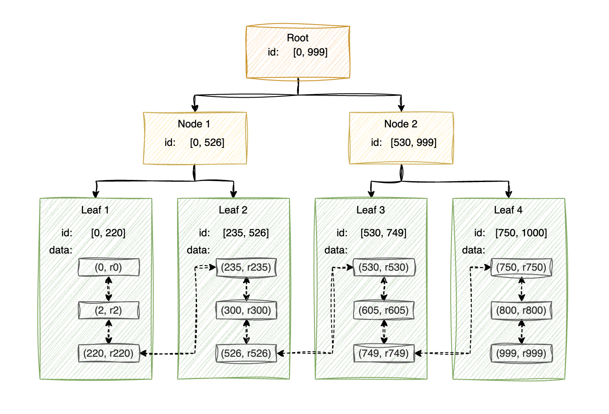

# B+ 树

B+ 树用较高的分支数量和有序叶子页减少存储查询的页面访问，是 InnoDB 常规索引使用的数据结构。

## 1. B+ 树由内部节点和叶子节点组成

B+ 树是一棵高度平衡的多路搜索树，所有叶子节点位于同一深度：

- **内部节点**保存分隔键与子节点指针，用于判断下一步访问哪个页面。
- **叶子节点**保存索引记录，并按照键值顺序组织。
- **相邻叶子页**可以顺序访问，便于范围扫描。



“阶数”在不同教材中的定义并不完全一致，有时表示最大子节点数，有时表示最大键数量。理解数据库索引时更重要的是页面大小、键宽和每页分支数，不能脱离实现死记一个占用率公式。

## 2. 页面分支数决定树高

数据库通常按固定大小的数据页读取索引。内部页不保存完整业务行，可以容纳较多分隔键和子页指针，形成较高的 fan-out。

假设一个内部页平均指向 500 个子页，三层树就能覆盖约 `500 × 500` 个叶子页。真实容量还取决于页大小、键长度、记录头、填充率与实现，因此这个数字只用于理解：分支数越高，同样数据量需要的树高通常越低。

根页和常访问的内部页往往位于缓冲池中，一次查询的实际磁盘读取不能简单等同于树高。树高仍然决定了最坏情况下需要经过多少层导航。

## 3. 等值查询从根节点逐层定位

等值查询从根节点开始，根据分隔键选择子页，直到叶子页，再在页内找到目标记录。复杂度通常写作 `O(log_f N)`，其中 `f` 是平均分支数量。

在 InnoDB 中，找到叶子记录后能否直接返回取决于索引类型：

- 聚簇索引叶子包含完整行，可以直接获得记录。
- 二级索引叶子包含二级索引列与主键，查询其他列时还要访问聚簇索引。

后一种访问就是回表，数据结构相同，但叶子记录保存的内容不同。

## 4. 范围查询沿叶子页继续读取

范围查询先通过树定位起点，再按叶子记录的键值顺序向后读取：

```sql
SELECT *
FROM users
WHERE id >= 10000 AND id < 10100;
```

数据库不需要为范围中的每一行重新从根节点查找。相同顺序还可以支持索引排序和前缀匹配，但前提是查询顺序与索引键顺序兼容。

哈希索引没有键值顺序，适合等值查找，却不能直接提供这种范围扫描。经典 B 树的内部节点也可以保存数据记录，导航页能容纳的键通常更少；B+ 树把记录集中在叶子层，更适合按页组织的高分支索引。

## 5. 插入和删除可能调整页面

插入先定位目标叶子页。页面有空间时直接写入；页面空间不足时可能发生页分裂，并把新的分隔信息传播到父节点。分裂一路传播到根节点时，树高会增加。

删除记录后，数据库可以合并页面、重新分配记录或保留空闲空间，具体策略由实现决定。更新索引键通常等价于删除旧键并插入新键，也可能引发更多页面与日志写入。

随机主键会把插入分散到多个叶子页，可能增加页分裂和缓存压力；单调递增主键更容易追加到右侧，但高并发下也可能形成右端热点。主键选择应结合写入模式、键宽与分布判断。

## 6. B+ 树不保证查询一定高效

数据结构只提供有序访问能力。查询仍可能因为以下原因读取大量页面：

- 条件无法形成连续键值范围。
- 选择性低，目标范围本身包含大量记录。
- 二级索引命中很多行，并对每行进行随机回表。
- 统计信息不准确，优化器选择了成本更高的路径。
- 索引键过宽，降低每页分支数并增加存储成本。

因此，解释 B+ 树后还要回到具体 SQL、索引定义与执行计划。

## 7. 常见问题

### 7.1 B+ 树的叶子节点为什么要保持有序

有序叶子页让数据库定位范围起点后继续顺序读取，还能在索引顺序匹配时省去额外排序。只有树形导航而没有有序叶子范围，区间查询会产生更多重复查找。

### 7.2 B+ 树查询一定只发生三次磁盘 I/O 吗

不一定。树高取决于数据和键宽，页面还可能已经位于缓冲池中；二级索引回表、范围跨页和底层存储预读都会改变实际 I/O。用固定“三层、三次 I/O”只能帮助估算，不能描述所有查询。

## 8. 面试题

### 8.1 MySQL 为什么常用 B+ 树索引，而不直接使用二叉树或哈希表

<!-- 面试来源：
- 美团：https://www.nowcoder.com/discuss/608995688709455872
-->

**出现公司**：美团

**考察重点**

- 数据页、分支数量与树高。
- 等值、范围和排序访问。
- 叶子记录、回表和写入维护成本。

**相关内容**：[B+ 树由内部节点和叶子节点组成](#1-b-树由内部节点和叶子节点组成)至[B+ 树不保证查询一定高效](#6-b-树不保证查询一定高效)。

<details>
<summary>参考回答</summary>

数据库按页读写，B+ 树内部页只保存导航键和子页指针，一个页面能容纳较多分支，因此大量数据下树高仍较低。二叉树每层只有少量分支，会增加页面访问；未平衡结构还可能退化。B+ 树的叶子记录有序，定位起点后可以连续扫描范围，也能在顺序匹配时支持排序。

哈希适合等值定位，但没有键值顺序，不能直接支持范围和排序。B+ 树也有代价：索引占空间，写入需要维护页面，二级索引查询其他列时可能回表。最终性能还取决于键宽、选择性、缓存命中和 SQL 访问路径，不能只根据树的名称判断。

</details>

:::note 参考资料

1. [MySQL 8.4：The Physical Structure of an InnoDB Index](https://dev.mysql.com/doc/refman/8.4/en/innodb-physical-structure.html)
2. [MySQL 8.4：Clustered and Secondary Indexes](https://dev.mysql.com/doc/refman/8.4/en/innodb-index-types.html)

:::
