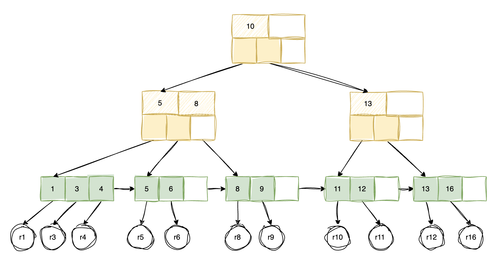

# B+ 树

B+ 树是最常用的索引数据结构，在数据库中被广泛应用。也是数据库索引常考的知识点。

## 1. B+ 树简介

### 1.1 B+ 树的特点

1. B+ 树是一种特殊的**平衡树**，通常用于数据库和文件系统中
2. B+ 树的每个节点最多有 `M` 个子节点，`M` 是 B+ 树的阶数
3. 区别于其他平衡树，B+ 树最重要的特点就是：**所有的数据只存储在叶子节点中**
4. 每个叶子节点都有指向兄弟节点的指针，所有叶子节点组成了一个有序链表，便于进行范围查询

下图为一个 3 阶的 B+ 树：



### 1.2 与 B 树的区别

B+ 树是对 B 树的一种优化。二者的核心区别如下：

1. B+ 树**只在叶子节点存储数据**，而 B 树所有的节点都会存储数据
2. B+ 树的**叶子节点之间有指针**，组成了一个链表，便于进行范围查询

从上面的区别也可以推导出二者在查询和存储上的性能区别：

1. **B+ 树会占用更多的存储空间**：B+ 树只有叶子节点保存数据，相比 B 树，会多出许多用于索引的中间节点
2. **B+ 树范围查询更快**：B+ 树的叶子节点组成了一个有序链表，在找到范围的起点后，可以快速找到范围的终点
3. **B+ 树单点查询稍慢一下**：因为 B 树每一个节点都保存了数据，所以在遍历时，查询到指定节点会立即结束查询。而 B+ 树一定要遍历到叶子节点才能结束查询

## 2. B+ 树的结构

### 2.1. 节点种类

我们可以将 B+ 树的节点分为三类：

1. **叶子节点**：在 B+ 树的最底层，存储实际的数据
2. **中间节点**：存储子节点的索引，用于快速定位数据
3. **根节点**：一种比较特殊的节点。通常是一个中间节点。如果 B+ 树此时只有一个节点，那么根节点同时也是叶子节点

### 2.2. 节点结构

与普通树的节点结构类似，只是 B+ 树中会稍微区分一下中间节点与叶子节点的结构。

对于中间节点来说，需要保存子节点的索引，以及指向子节点的指针。

```java
class InternalNode extends Node {
    private boolean isLeaf; // 是否是叶子节点
    private List<Node> keys; // 保存子节点的索引
}
```

而叶子节点则需要保存数据，以及指向兄弟节点的指针。

```java
class LeafNode extends Node {
    private boolean isLeaf; // 是否是叶子节点
    private List<T> data; // 保存数据
    private LeafNode next; // 指向兄弟节点的指针
}
```

### 2.3. 节点与 Keys 的数量

`M` 是 B+ 树的阶数，表示每个节点最多有 `M` 个子节点，这里还有另一层含义。

每一个子节点都索引了一段数据，每向下一层，这一段数据又会被拆分成最多 `M` 个子分段。

将一段数据切分为 `M` 个子分段，需要 `M-1` 个索引。所以，每个中间节点，`Keys` 的数量最多为 `M-1`。

## 3. B+ 树的常见操作

### 3.1. 单点查询

先来看一下最简单的单记录的查询。与使用搜索树查询的流程一致：

1. 从 `Root` 节点开始，遍历所有的 `Keys`，找到待查询的 `Key` 所在的子节点
2. 重复这一个过程，直到遍历到叶子节点
3. 搜索叶子节点中的数据，查询是否有对应的记录。这一步可以使用 **二分查找** 来优化

### 3.2. 范围查询

范围查询的流程与单点查询类似，只是多了一个遍历到终点的步骤。

1. 根据单点查询的流程，找到范围的起点
2. 从起点开始，沿着叶子节点顺序遍历，直到范围的终点。这期间的数据就是范围查询的结果

因为叶子节点之间有指针，所以遍历的过程是线性的。只会在查询起点时对树进行搜索。

:::tip 常见考点：为什么叶子节点要连成链表？
因为在范围查询中，经常要跨多个叶子节点查询数据，如果叶子节点之间没有指针，那么需要重新搜索树，才能够找到下一段数据的起点。
:::

### 3.3. 插入

相比于查询，插入与删除操作要麻烦一些，因为会涉及到树的「再平衡」。

B+ 树要求每个节点的 `Keys` 数量在 `[M - 1/2, M]` 之间。一旦超出了这个范围，就需要进行再平衡。

1. 基于范围查询的步骤，找到需要插入新的数据的叶子节点
2. 如果插入后，节点的 `Keys` 数量在 `[M - 1/2, M]` 之间，则直接插入
3. 如果插入后，节点的 `Keys` 数量超过了 `M`，则需要重新平衡 B+ 树
4. 将当前节点分裂为两个节点，保证每个节点的 `Keys` 数量在 `[M - 1/2, M]` 之间
5. 将分离后的右侧的节点的 `Key` 值插入到父节点中
6. 需要注意的是，在父节点插入 `Key` 值后，可能会导致父节点也超出 `Keys` 数量范围，需要继续递归分裂父节点
7. 如果直到 `Root` 节点也超出了 `Keys` 数量范围，则 `Root` 节点也需要分裂，此时需要创建一个新的 `Root` 节点，树的高度增加一层

### 3.4. 删除

删除操作的流程与插入操作类似，只是将节点的分裂操作改为合并操作，并且多了一个「借」的操作。

1. 基于范围查询的步骤，找到需要删除的数据的叶子节点
2. 如果删除后，节点的 `Keys` 数量在 `[M - 1/2, M]` 之间，则直接删除
3. 如果删除后，节点的 `Keys` 数量低于 `M - 1/2`，则需要重新平衡 B+ 树
4. 重新平衡的时候，首先会尝试向兄弟节点「借」一个 `Key` 值，如果兄弟节点有多于的 `Key` 值（也就是借出一个节点后，依然满足 `Keys` 数量范围），则直接借一个过来，然后调整父节点中的 `Keys` 值
5. 如果兄弟节点都无法借出，则需要将当前节点与兄弟节点合并，并且对应地减少父节点中 `Keys` 的数量
6. 仍然要注意，减少父节点的 `Keys` 数量后，可能会导致父节点也超出 `Keys` 数量范围，需要继续递归调整父节点
7. 如果递归调整到 `Root` 节点，`Keys` 的数量只有一个，也就是刚刚合并后的子节点，那么删除掉现有的 `Root` 节点，将合并后的子节点作为新的 `Root` 节点，树的高度减少一层

「**借出**」的操作是删除流程中一个小优化。因为如果借出操作成功，那么不会影响到父节点的 `Keys` 数量，所以不需要继续递归调整父节点。

### 3.5. 再平衡的要点

再平衡的要点就是：

1. 保证节点的 `Keys` 数量在 `[M - 1/2, M]` 之间，不论是超出或者低于，一旦节点 `Keys` 数量不满足条件，就需要进行再平衡
2. 再平衡过程中，可能会导致父节点的 `Keys` 数量也不满足条件，需要继续递归分裂父节点
3. 如果递归的节点是 `Root` 节点，`Keys` 的数量依然不满足条件，则要根据情况创建新的 `Root` 节点，或者合并已有的节点成为新的 `Root` 节点，此时会导致树的高度变化

## 4. 常见考点

1. B+ 树的特点是什么，与 B 树的区别是什么
2. 为什么 B+ 树的叶子节点要连成链表
3. B+ 树的查询、插入、删除操作的流程是什么
