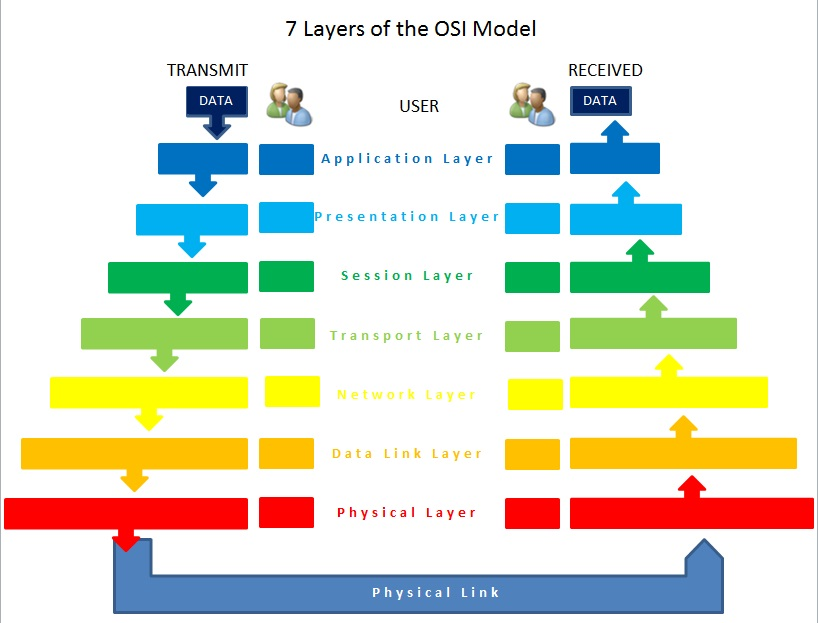
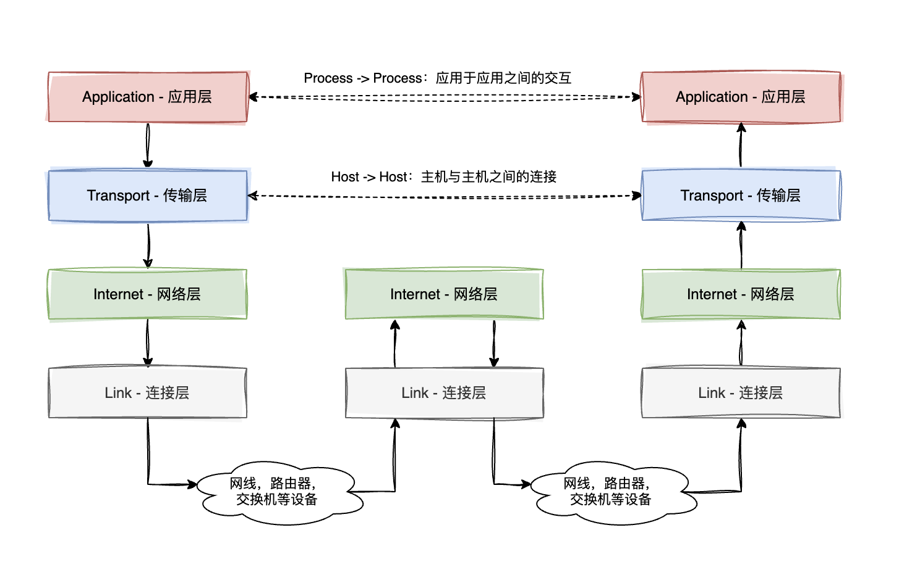
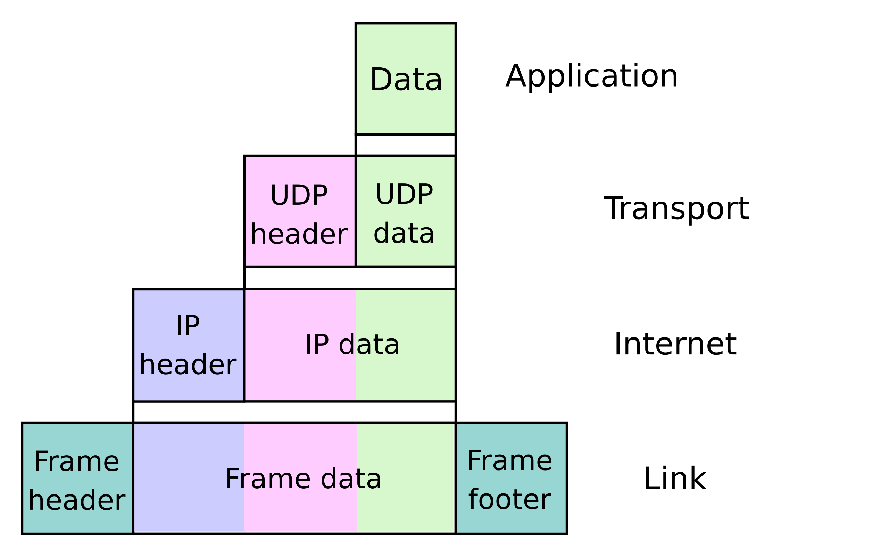

# 网络模型

:::tip 基本问题
1. 为什么要有网络模型 ── 规范不同设备之间的连接问题
2. 基本的网络模型 ── **OSI 七层模型** 与 **TCP/IP 四层模型**
3. 不同层级之间如何进行交互
4. 什么是 **四层负载均衡**，什么是 **七层负载均衡**
:::

## 1. 简述

### 1.1. 为什么需要网络模型

网络的一个基本作用就是将不同的设备连接起来进行通信。在"万物互联"的当下，参与到网络通信的设备数量庞大，种类繁多，你无法想象在互联网的另一头，与你的电脑通信的是一台电脑，还是一部手机，甚至可能是冰箱或者彩电。因此，如何规范不同设备之间网络数据的传输方式，就是一个必须解决的问题。

网络模型就是用来规范不同设备之间网络数据传输的标准。

### 1.2. OSI 七层模型与 TCP/IP 四层模型

当我们提到网络模型时，通常指 OSI 七层模型与 TCP/IP 四层模型。

OSI 模型由**国际标准化组织（ISO）**提出，旨在为不同的客户端系统提供一个共同的标准，以便于它们能够相互通信。作为标准化的模型，OSI 具备扎实的理论基础，但是此时 **TCP/IP 模型**已经应用到了早起互联网上，因此 OSI 模型并没有在实际环境得到应用，如今更多的作为教学模型被使用。

与 OSI 相反，**TCP/IP 模型**作为早期互联网通信的基础模型，更早的在实际的网络环境中得到使用。虽然 TCP/IP 模型层级划分上不像 OSI 模型那样精细，但是其更加符合实际的应用场景，或者说作为互联网通信的实际标准，真实的网络传输都是遵照 TCP/IP 模型来设计。

> 只有 TCP/IP 模型是实际应用的模型，OSI 模型更多作为网络模型的理论基础。

## 2. OSI 七层模型

### 2.1. OSI 模型设计原则

虽然 OSI 七层模型基本没有在实际环境中被使用，但是其合理的划分了网络层次，为网络协议的设计提供了理论指导。作为一个教学工具，能够帮助我们更好的理解数据是如何在网络中传输的。

OSI 模型的分层基本原则包括：

1. 应该在需要一个不同抽象的地方创建一层
2. 每一层都应该执行一个明确定义的功能
3. 层与层边界的选择应该使跨层的信息流量最小
4. 层数不能太多也不能太少，既要保证不同层级功能解耦，也不能让系统过于庞大

让我们从上到下，逐层分析 OSI 七层模型。

### 2.2. OSI 模型 ── 自顶向下介绍

#### 2.2.1. Application - 应用层

应用层是 OSI 七层模型中的最高层，也是第七层。

这是最接近用户的一层，我们日常使用的网络服务就位于这一层级。最典型的例子就是浏览网页使用的 HTTPS、HTTP 协议，收发邮件使用的 SMTP 协议等等。

#### 2.2.2. Presentation - 表示层

表示层是 OSI 七层模型中的第六层。也是 OSI 模型中最抽象的一层。

应用层中包含了用户会直接使用到的服务，可以是查看新闻，浏览图片，观看视频等等。但是一切数据的本质都是二进制数据流，在传输过程中，我们传输的也都是 **0** 与 **1** 的字节流。那么如何将这些二进制信息映射到用户可以理解的信息，这就是表示层需要做的事情。

**表示层** 规定了网络传输的数据会以什么形式展示，比如文字、图片等等；一些网络接口使用到的数据结构，也是在表示层进行管理。

#### 2.2.3. Session - 会话层

很多网站要求用户登录后才可以访问。当我们登录网站后，我们就与服务器之间建立了「会话（Session）」。

**会话层**就是用来维护这些登录信息。

:::info
OSI 模型处于解耦的目的，会单独划分出**表示层**与**会话层**。

而现代互联网应用中，普遍都是由应用层直接处理用户的登录信息，这也与 **TCP/IP** 模型的层级划分相符。
:::

#### 2.2.4. Transport - 传输层

传输层是 OSI 七层模型中的第四层，也是 OSI 七层模型中，最核心的一层。

传输层是 OSI 七层模型的一个分水岭，在传输层之上的层级（应用层，表示层，会话层），更多的关心需要传输哪些用户的数据，更偏向于用户使用的应用。而从传输层开始，更多的关系一件事：**数据如何在网络中传输**。

传输层中，最核心的协议就是 TCP 与 UDP。我们会在 [TCP 与 UDP 传输协议](./tcp_udp.mdx) 中详细讨论。

#### 2.2.5. Network - 网络层

网络层是 OSI 七层模型中的第三层。

如果说传输层规范了数据如何在网络中传输，那么网络层就是解决「**数据传输到哪里**」的问题。

在网络层中，最重要的就是 IP 协议，用于表示网络设备在互联网中的地址。

#### 2.2.6. Data Link - 数据链路层

数据链路层是 OSI 七层模型中的第二层。

在知道数据传输的地址（IP 地址）后，我们还需要建立一条到目的地的"**通道**"。

通常当我们访问网络应用时，不会有一条网线连接我们与目标服务器，而是通过路由器、交换机等设备，将数据传输到目的地。

数据链路层就是负责建立这条"**通道**"，链接我们与目标服务器之间的所有设备。

既然是建立设备之间的链接路径，那么就会应用到设备的身份标识，也就是 MAC 地址。

#### 2.2.7. Physical - 物理层

物理层是 OSI 七层模型中的第一层，也是 OSI 模型的最底层。

物理层不用多说，就是真实的网络设备了，包括网线、光纤、无线网络设备等等。

### 2.3. OSI 模型示意图

引用 [OSI - Wikipedia](https://en.wikipedia.org/wiki/OSI_model) 中的示意图：

作者 MrsValdry，CC BY-SA 3.0，https://commons.wikimedia.org/w/index.php?curid=16941456

## 3. TCP/IP 四层模型

### 3.1. 真实世界的网络模型

**TCP/IP 模型** 在理论基础上不像 OSI 模型那样极其扎实，但是 TCP/IP 模型是根据实际的网络环境设计，也是真正在实际网络环境中被使用的模型。

### 3.2. TCP/IP 模型

虽然 TCP/IP 与 OSI 模型的分层不同，但是还是具备很多相似之处，从某种程度来说，TCP/IP 模型算是 OSI 模型的简化版本。

TCP/IP 模型自顶向下分为四层：

1. **Application - 应用层**：对应 OSI 模型的**应用层**、**表示层**、**会话层**
2. **Transport - 传输层**：对应 OSI 模型的**传输层**
3. **Internet - 网络层**：对应 OSI 模型的**网络层**
4. **Link - 连接层**：也叫**网络接口层（Network Interface Layer）**，对应 OSI 模型的**链路层**与**物理层**

#### 3.2.1. 应用层

**应用层**是 TCP/IP 模型中的第四层，也是最顶层。是 TCP/IP 模型中，最接近用户的一层。

不像 OSI 模型区分的那么细致，对于大部分现在网络应用来说，应用层涵盖了所有与用户直接交互的功能，包括数据结构定义，以及用户登录信息管理。

#### 3.2.2. 传输层

**传输层**是 TCP/IP 模型中的第三层，也是 TCP/IP 模型中，是名字中 **TCP** 的来源。

这一层同样负责决定**用户的数据如何在网络中传输**。

同样传输层中包含了 TCP 与 UDP 两个核心协议，我们将在 [TCP 与 UDP 传输协议](./tcp_udp.mdx) 中详细讨论。

#### 3.2.3. 网络层

**网络层**是 TCP/IP 模型中的第二层，也是 TCP/IP 模型中，是名字中 **IP** 的来源。

与 OSI 模型一样，这一层主要是解决**用户数据传输到哪里**的问题

网络层中最重要的协议就是 IP 协议，用于表示网络设备在互联网中的地址。

#### 3.2.4. 连接层

**连接层**是 TCP/IP 模型中的第一层，也是 TCP/IP 模型中的最底层。

连接层主要用来解决**用户的数据如何在真实的物理网络中传输**的问题。

### 3.3. TCP/IP 模型示意图

参考 [TCP/IP 模型示意图](https://en.wikipedia.org/wiki/Internet_protocol_suite) 中的示意图：

### 3.4. 不同层级的交互

以一个网络请求为例，不论是 OSI 模型还是 TCP/IP 模型，从应用层开始，每向下走一层，下层都协议都会在上层的基础上，增加一些额外的头部信息，供接收方同一层级进行解析。这也是在 TCP/IP 的示意图中，为什么加上了接收方与发送方的层级之间的连线。

这里给一个 TCP/IP 的示意图，帮助理解：

作者 en:User:Cburnett original work, colorization by en:User:Kbrose - Original artwork by en:User:Cburnett，CC BY-SA 3.0，https://commons.wikimedia.org/w/index.php?curid=1546338

## 4. 四层与七层负载均衡

在日常开发中，我们经常听到两个数据「**四层负载均衡**」与「**七层负载均衡**」。

这里的 **四层** 与 **七层** 指的是在 **OSI 七层模型** 中，负载均衡发生的层级：

1. **四层负载均衡**：在 **传输层** 进行负载均衡，更多考虑的是对**传输行为**进行负载均衡，比如根据 **IP 地址**与**端口**进行负载均衡
2. **七层负载均衡**：在 **应用层** 进行负载均衡，更多考虑的是**根据应用本身的行为**进行负载均衡，比如根据 **HTTP 请求的头部信息**进行负载均衡

二者的核心关键在于，是需要根据什么信息进行负载均衡。

比如对不同地域的用户进行灰度测试的场景，我们就可以使用**四层负载均衡**，根据用户的地理位置，将用户请求分发到不同的服务器上。

而如果需要对用户的读写请求进行分流，我们就可以使用**七层负载均衡**，根据 HTTP 请求的头部信息，比如请求的 URL 路径，将读写请求分流到不同的服务器上。

更简单的理解，如果是对 URL 中的信息进行负载均衡，那么就是七层负载均衡；如果是对请求的来源进行负载均衡，那么就是四层负载均衡。

> 实际情况，HTTP 请求头的信息都可以用作七层负载，这里只是举一个最简单的例子，方便理解

## 5. 复习要点

网络模型在实际的面试中，很少会单独出现，因为属于纯背诵的内容，很难考察出候选人的实际水平。

但是同样，网络模型作为计算机网络领域的基础，了解网络模型的内容，有助于我们理解网络传输的本质。

在本章中，建议重点掌握以下内容：

1. **OSI 七层模型** 与 **TCP/IP 四层模型** 有哪些层级，分层的依据是什么？
2. 不同层级之间如何交互的？
3. 什么是 **四层负载均衡**，什么是 **七层负载均衡**？

### 5.1. **OSI 七层模型** 与 **TCP/IP 四层模型** 有哪些层级？

详见文中对与 OSI 七层模型与 TCP/IP 四层模型的详细介绍。

### 5.2. 不同层级之间如何交互的？

每一层都会执行一个明确的功能。

下一层会在上一层的基础上，增加额外的头部信息，用来存储当前层级需要传输的数据。

接收方的同一层级会处理当前层级增加的头部信息。

### 5.3. 什么是 **四层负载均衡**，什么是 **七层负载均衡**？

四层与七层负载均衡算是网络模型的扩展内容，在实际的工作中，经常会遇到这两个内容。

四层与七层负载均衡的核心区别，是针对于**传输方式**进行负载均衡，还是针对于**传输的内容**，也就是**应用本身的行为**进行负载均衡。