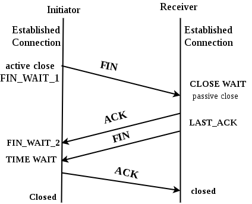

# TCP 三次握手与四次挥手

TCP 的「三次握手」与「四次挥手」指的是在 TCP 建立连接与断开连接时，需要由发送方与接收方进行相互确认的流程。

这也是提到 TCP 的时候，最先会想到的考点。

如果了解过三次握手与四次挥手，那么应该会记得在建立连接的过程中，需要发送各种信号以及确认信号。而三次握手与四次挥手的本质，实际上要更简单一些。本文将用最简明的方式，让你一次搞懂为什么需要三次握手与四次挥手，为什么不是其他的次数？让你彻底理解 TCP 建立连接与断开连接的本质。

## 1. TCP 连接的本质

TCP 是可靠性传输协议，建立连接，就是为了确保两件事：

1. 发送方与接收方都能够接收到对方的「**确认信号**」
2. 发送方的数据能够**全部**到达接收方

理解了这两点，就会明白为什么需要三次握手与四次挥手。

## 2. 三次握手

### 2.1. 简单易懂的三次握手原理

我们先来看三次握手。其实生活中不乏有「三次握手」的例子。

想象一下，如果两个人（A 与 B）在打电话，为了正常沟通，他们需要确定：**对方能够听到自己的声音**，那么这个确认过程应该是怎样的？

> A 对 B 说：「你能听到我说话吗？」
>
> B 回复 A：「可以。你能听到我说话吗？」
>
> A 回复 B：「我也可以。」

这其实就是一个抽象的三次握手的过程。这个流程最终的目的是要保证：**对方可以接收到自己的信息**。这里又隐含了两个条件：

1. 向对方发送一次信息
2. 确认可以接收到对方的信息

带着这样的条件，我们再来看 A 与 B 建立通话的过程：

1. A 向 B 发送信息，期望 B 可以收到自己的信息
2. B 告诉 A 可以接收到他的信息，同时也期望 A 能够接收到自己的这条信息
3. A 告诉 B 可以接收到他的信息，至此双方都能够接收到对方的信息了。

理解了这一个过程，也会理解为什么建立连接的时候，握手的次数恰好是「**三次**」。

在第一次与第二次握手时，A 确认了 B 能够接收到自己的消息，也就是收到了 B 对于自己发出信息的确认。但此时 B 仅仅是发出了消息，还没有收到 A 能听到自己的消息的确认（第一次握手仅仅是表示 B 能够收到 A 的消息）。也因此需要再有第三的握手，A 向 B 发送信号，确认能够听到 B 的信息。此时，双方才算正式建立连接，完成了「**对方可以接收到自己的信息**」的确认。

:::tip
三次握手的本质：**确认对方可以接收到自己的信息**。
:::

### 2.2. TCP 的三次握手

真实的 TCP 三次握手流程，与上述的流程基本一致，只不过发送的内容变为了特殊的*信号*。

1. 第一次握手：客户端发送 `SYN` 信号，表示准备与服务端建立连接。
2. 第二次握手：服务端收到 `SYN` 信号后，回复 `SYN+ACK` 信号，确认自己可以接收到客户端的信息，并确认客户端是否能收到自己的信息
3. 第三次握手：客户端收到 `SYN+ACK` 信号后，回复 `ACK` 信号，确认自己可以接收到服务端的信息。

为了节省网络请求的次数，客户端会在第三次握手时，顺带开始发送需要传输的数据。

这里信号分为两种，`SYN` 用来请求与对方建立连接，而 `ACK` 表示可以接收到对方的信息。

真实的网络世界中无时无刻不再建立网络连接。TCP 在建立连接时，需要保证回复的是正确的请求。因此 SYN 与 ACK 的实际值，其实是 TCP 头部中的序号。每次建立连接时，会发送当前的序号 `seq=m`，也是这次发送的 `SYN` 的值。如果服务端能够接收到这条信息，`ACK` 的值就是 `m+1`，确保我们回复的 `ACK` 的值是正确的。

## 3. 四次挥手

四次挥手本质上与三次握手一致，只是多了一个步骤：**保证对方接收到了自己的所有信息**。

### 3.1. 简单易懂的四次挥手原理

继续用打电话的例子来理解四次挥手。

现在 A 与 B 要结束通话了，但是他们要保证自己的话全部都"传达到位"。

> A 向 B 说：「今天我就先说这么多了，我准备挂了啊！」
> 
> B **听完**了 A 的所有内容，回复 A：「行，那我也收个尾吧！」
>
> B 把最后想跟 A 说的话说完：「那好，我最后也就说这么多了，我也准备挂了啊！」
>
> A **听完**了 B 的所有回复，然后表示：「好的，我们下次再见！」

可以看到在这个过程当中，有一个很重要得一点，就是 A 与 B 都确认听完了对方的内容。因为要保证所有传输的内容都被接受，所以在断开连接时，需要「**四次挥手**」。

我们再来看一下每一次挥手的目的与作用：

1. 第一次挥手：A 表示自己的内容已经发送完毕，希望断开连接
2. 第二次挥手：B 通知 A 已经接收到了 A 的全部信息。但是 B 可能还有一些信息想要传递，所以此时连接还依然存在
3. 第三次挥手：B 表示自己的内容也已经发送完毕，希望断开连接
4. 第四次挥手：A 通知 B 已经接收到了 B 的全部信息，连接正式断开

:::tip
四次挥手的本质：**确认对方接收到了自己的所有信息**。
:::

### 3.2. TCP 的四次挥手

1. 第一次挥手：客户端发送 `FIN` 信号，表示自己想要断开连接
2. 第二次挥手：服务端收到 `FIN` 信号后，回复 `ACK` 信号，确认自己可以接收到客户端的信息
3. 第三次挥手：服务端发送 `FIN` 信号，表示自己想要断开连接
4. 第四次挥手：客户端收到 `FIN` 信号后，回复 `ACK` 信号，确认自己可以接收到服务端的信息

### 3.3. 一些常见问题

**为什么断开连接需要四次挥手？**

与三次握手不同的是，因为 TCP 连接是双向的，双方都在发送信息，所以当一方的信息都发送完毕后，需要等待另一方的信息也全部发送完毕。这就是为什么第二次与第三次挥手，都是与接收方发起的。

**为什么第二次与第三次挥手不能合为一个？**

因为 TCP 会将发送的数据打包成一个个「数据包」。在第二次挥手时，服务端可能还有数据包没有发送完毕。需要等到发送最后一个数据包时，才能发送 `FIN` 信号，通知客户端信息已经发送完毕。