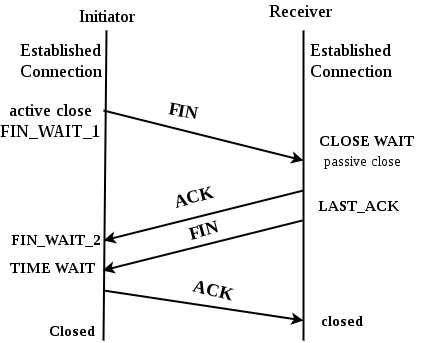

# TCP 三次握手与四次挥手

TCP 通过三次握手同步连接状态与初始序列号，通过两个方向分别关闭来释放全双工连接。

## 1. TCP 连接保存双方状态

TCP 向应用提供可靠、有序的字节流。通信双方需要维护序列号、确认号、接收窗口和连接状态，后续数据才能被确认、重传并按顺序交付。

建立连接时需要完成两件事：

1. 确认客户端到服务端、服务端到客户端的通信路径可用。
2. 交换双方的初始序列号，避免新连接把网络中迟到的旧报文当成当前数据。

连接是全双工的，两个方向可以独立发送数据，也可以独立结束发送。这一点决定了关闭过程通常需要分别处理两个方向。

## 2. 三次握手同步初始序列号

假设客户端初始序列号为 `x`，服务端初始序列号为 `y`：

1. 客户端发送 `SYN`，序列号为 `x`，进入 `SYN-SENT`。
2. 服务端回复 `SYN + ACK`，序列号为 `y`，确认号为 `x + 1`，进入 `SYN-RECEIVED`。
3. 客户端回复 `ACK`，确认号为 `y + 1`。服务端收到后，双方进入 `ESTABLISHED`。

`SYN` 会占用一个序列号，因此确认号在对方序列号基础上加一。第三个报文可以同时携带应用数据，但服务端必须收到该 ACK，才能确认客户端已经接收自己的 SYN 和初始序列号。

## 3. 两次交互无法完成双方确认

如果只有客户端的 `SYN` 和服务端的 `SYN + ACK`，客户端能够确认服务端收到了自己的请求，服务端却不知道自己的回复是否到达客户端。服务端也就无法判断对方是否接受了本次连接参数。

第三次 ACK 完成服务端方向的确认。它还可以帮助服务端区分有效的新连接与网络中迟到的旧 SYN，避免仅凭一个历史请求就进入已建立状态并分配完整连接资源。

三次握手仍不能证明未来的数据一定到达。它只建立当前连接状态，后续可靠性继续依赖序列号、确认、超时重传和拥塞控制。

## 4. 四次挥手分别关闭两个方向

以客户端主动关闭为例：

1. 客户端发送 `FIN`，表示客户端已经没有更多数据发送，进入 `FIN-WAIT-1`。
2. 服务端确认该 `FIN`，进入 `CLOSE-WAIT`；客户端收到 ACK 后进入 `FIN-WAIT-2`。此时服务端仍可以继续发送剩余数据。
3. 服务端应用完成发送并关闭连接后，服务端发送自己的 `FIN`，进入 `LAST-ACK`。
4. 客户端确认服务端的 `FIN`，进入 `TIME-WAIT`；服务端收到最后的 ACK 后关闭连接。

第二步的 ACK 与第三步的 FIN 可以在同一个报文中发送，因此抓包时不一定总能看到四个独立报文。“四次挥手”描述的是两个方向各自发送 FIN 并获得确认的逻辑过程。

## 5. TIME_WAIT 与 CLOSE_WAIT 指向不同问题

主动关闭的一方在发送最后一个 ACK 后进入 `TIME-WAIT`，通常等待 `2MSL`。这段时间允许它在最后 ACK 丢失、对方重传 FIN 时再次回复，也让旧连接中的迟到报文从网络中消失，避免污染随后复用相同四元组的连接。

被动关闭的一方收到 FIN 后进入 `CLOSE-WAIT`。这个状态表示对端已经停止发送，本地应用还没有关闭自己的方向。少量、短暂的 `CLOSE-WAIT` 属于正常过渡；持续堆积通常说明应用没有及时关闭 socket，或相关线程被阻塞。

大量 `TIME-WAIT` 不等于连接泄漏。应先确认谁在主动关闭、连接是否缺少复用，以及端口范围、并发量和持续时间是否已经造成实际资源压力。

## 6. 常见问题

### 6.1 为什么建立连接通常是三次，关闭通常是四次

建立连接时，服务端可以把对客户端 SYN 的 ACK 与自己的 SYN 合并，所以三个报文能够完成双方初始序列号确认。关闭时，一方收到 FIN 后可能还有数据要发送，只能先 ACK，等应用完成发送后再发自己的 FIN，因此通常表现为四个报文。

### 6.2 收到 FIN 是否表示连接中的数据都处理完了

FIN 表示发送方不会再发送新的字节，它在序列空间中位于此前数据之后。接收端协议栈会按序交付，但这不代表应用已经完成业务处理；应用仍需读取剩余数据并正确关闭资源。

## 7. 面试题

### 7.1 为什么 TCP 建立连接需要三次握手，TIME_WAIT 有什么作用

<!-- 面试来源：
- 字节跳动：https://www.nowcoder.com/discuss/353156517979430912
- 美团：https://www.nowcoder.com/discuss/353154541233315840
-->

**出现公司**：字节跳动、美团

**考察重点**

- 双向可达、初始序列号与连接状态。
- 全双工关闭、半关闭和 ACK/FIN 合并。
- TIME_WAIT、CLOSE_WAIT 与线上连接问题。

**相关内容**：第 1 节“TCP 连接保存双方状态”至第 5 节“TIME_WAIT 与 CLOSE_WAIT 指向不同问题”。

参考回答

客户端先发 SYN 和初始序列号，服务端用 SYN+ACK 确认客户端并发送自己的初始序列号，客户端最后用 ACK 让服务端确认其 SYN 已被接收。两次交互时服务端无法确认客户端是否收到自己的连接参数；三次能够同步双方状态和序列号，并降低旧 SYN 误建连接的风险。

TCP 是全双工连接，一个方向发送 FIN 后，另一个方向仍可能继续发送，所以关闭通常需要两个 FIN 分别得到确认。主动关闭方发送最后 ACK 后进入 TIME_WAIT，用于应对对方重传 FIN，并等待旧报文消失。CLOSE_WAIT 则表示本地应用收到对端 FIN 后仍未关闭自己的方向，长期堆积应检查 socket 关闭路径和阻塞线程。

:::note 参考资料

1. [RFC 9293：Transmission Control Protocol](https://www.rfc-editor.org/rfc/rfc9293)
2. [RFC 6528：Defending against Sequence Number Attacks](https://www.rfc-editor.org/rfc/rfc6528)

:::
