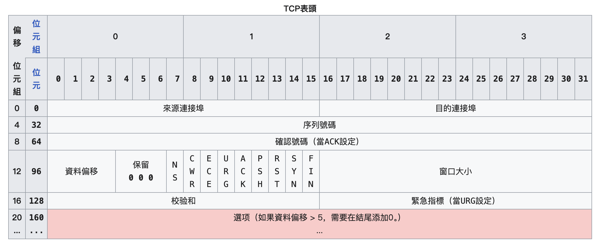

# TCP 与 UDP 传输协议

:::tip 核心要点
TCP 是「**可靠**」的传输协议，而 UDP 是「**不可靠**」的传输协议。

TCP 所有的特性都围绕着如何让 TCP 更加「**可靠**」而展开。

UDP 没有「可靠」的设计，换来的是**更快的传输速度**与**更低的延迟**。
:::

## 1. TCP 与 UDP 简述

### 1.1. TCP 与 UDP 的核心区别

[网络模型](./network-models.mdx)一章提到过，**传输层**关注的是如何传输应用层的数据。

为了应对不同的传输场景，传输层提供了两种不同的传输协议：

1. **TCP**：Transmission Control Protocol，传输控制协议。
2. **UDP**：User Datagram Protocol，用户数据报协议。

虽然全名很难记，但是大部分时候，我们只需要记住：

> TCP 是**可靠**的传输协议，而 UDP 是**不可靠**的传输协议。

这也是这两个协议最核心的区别。

### 1.2. TCP 与 UDP 的使用场景

既然 TCP 是可靠的传输协议，那么就用于需要保证数据完整性的场景。常见的有：

1. 浏览网页、视频、图片等等
2. 下载文件
3. 收发邮件

而 UDP 则用于对数据完整性要求不高，但是期望有更低的延迟的场景，常见的有：

1. 视频会议
2. 在线游戏

## 2. TCP

### 2.1. 可靠传输需要面对的问题

在谈及 TCP 为什么是 「**可靠**」 的传输协议之前，我们先来了解一下网络传输过程中，可能会面对的问题。

网络传输面对的最根本的问题：

> **网络本身是不可靠的**

相信我们日常生活中都遇到过这些问题：

1. 下载文件下载到了一半就丢失了
2. 语音电话、视频会议的时候，对方的声音忽然断断续续的
3. 网页上的图片加载了一半，突然就卡住了，无法加载剩下的一半

这都是网络不稳定导致的传输问题（当然，第 2 个例子通常会使用 UDP 协议）。

而 TCP，就是为了保证尽可能地将数据，从发送方完整地传输到接收方。它的「可靠」，就是解决了网络传输中，网络不稳定可能导致的种种问题。

### 2.2. TCP 可靠性设计

#### 2.2.1. 面向连接

TCP 是「**面向连接**」的协议。

如何理解 TCP 的面向连接？它要求在传输数据之前，数据的「**发送方**」与「**接收方**」保证一件事情：

> 发送方可以收到接收方的「消息」，接收方也可以收到发送方的「消息」。

当双方都保证可以收到对方的消息后，才会开始传输数据。建立连接的过程，被称为「**三次握手**」。

同样，在数据传输之后，也要确保所有的数据都传输完成，这个过程被称为「**四次挥手**」。

TCP 握手与挥手的过程，我们会在 [TCP 三次握手与四次挥手](./tcp_handshake.mdx) 中详细讨论。

#### 2.2.2. 数据分段

如果一次传输大量的数据，比如一个 `1000MB` 的视频，那么一旦因网络波动导致传输失败，就需要重新传输一整个文件。这显然是不可接受的。

因此 TCP 在传输数据时，会尽可能地将数据分割成更小的数据包，然后分批次传输。

这样做的好处是，即使网络波动导致数据包丢失，也只需要传输丢失的数据包即可，避免重新传输一整个文件。

同样每一个分段也会有一个序号，这样接收方在接收到数据后，可以按照序号重新组装成原始数据。如果丢失了某个数据包，也可以告诉发送方缺失的序号，发送方会重新传输。

#### 2.2.3. 校验与重传

解决了数据分段的问题后，接下来还要保证我们接受的数据包的正确性。网络传输的不确定性，让我们可能会接收到不完整的数据包，或者错误的数据包。

一个简单的解决办法是，计算传输内容的「**校验和**」，接收方接收到数据包后，重新计算一下校验和，如果与发送方计算的校验和一致，则认为数据包是完整的。

#### 2.2.4. 拥塞控制

TCP 的可靠性设计，还包含了对网络拥塞的控制。

网络拥塞，会导致数据包的丢失。TCP 会通过「**拥塞控制**」来避免网络拥塞。

拥塞控制的核心思想是，当网络拥塞时，降低发送方的发送速率。

### 2.3. TCP 头部

一个典型的 TCP 数据包通常分为两个部分：

1. TCP 头部 - TCP Header
2. TCP 负载 - TCP Payload

负载就是需要传输的内容，这里我们重点讨论 TCP 头部。

完整的 TCP 头部内容比较多，完全记住难度很大，也没有必要。只需要记住，**保证 TCP 可靠性的字段，都存储在 TCP 头部**。

TCP 头部中，最重要的字段是：

1. 源端口 - Source Port：发送方的端口
2. 目的端口 - Destination Port：接收方的端口，与源端口共同标识一个连接，TCP 与 UDP 共用的头部
3. 序列号 - Sequence Number：当前接收到的数据包的序号
4. 确认号 - Acknowledgment Number：期望的下一个数据包的序号
5. 窗口大小 - Window Size：通知对方自己还能接收多少数据，用于流量控制
6. 校验和 - Checksum：用于校验数据包的完整性
7. 标志位 - Flags：用于控制 TCP 的连接状态，比如「三次挥手」与「四次挥手」中

这些也对应了我们提到的 TCP 可靠性的设计。

另附一个完整的 TCP 头部示例：

## 3. UDP

### 3.1. TCP 的额外开销

与 TCP 相对，UDP 是「**不可靠**」的传输协议。

UDP 牺牲了 TCP 中「可靠」的设计，换来的是更快的传输速度与更低的延迟。

回看 TCP 的设计，每一个保证完整性的操作，都需要额外的开销。最基本的开销就是建立连接。TCP 需要经历三次握手，建立连接后，才会开始传输数据。距离真实的数据传输，已经经历了两个“来回”的网络延迟。

类似的操作还有很多，这些操作都会导致 TCP 在发送数据包之前，有额外的操作。

### 3.2. UDP 的特点

UDP 抛弃了 TCP 中「可靠」的设计，在传输数据上，UDP 会显得更加“直接”。

UDP 在发送数据的时候，只保证数据切实地「**发出**」了，至于数据是否到达接收方，UDP 并不关心。

比如说，在一个视频会议中，我们可以接受偶尔的断联，但是更多时候，还是希望对方的声音是流畅的。

### 3.3. UDP 的头部

UDP 的头部比较简单，

1. 源端口 - Source Port
2. 目的端口 - Destination Port
3. 长度 - Length：UDP 数据包的长度
4. 校验和 - Checksum：用于校验数据包的完整性

与 TCP 不同的是，UDP 有一个「**长度**」字段。这是因为在 TCP 中，数据被分段传输，通过序号我们可以拼凑出原始数据。

而 UDP 中，会将数据一次性发送出去，因此我们需要知道数据包的长度，这样我们才能知道数据包的边界。

## 4. 总结

TCP 与 UDP 是传输层中最重要的两个传输协议。

最核心的区别就是：TCP 是「**可靠**」的传输协议，而 UDP 是「**不可靠**」的传输协议。

围绕着 TCP 「可靠」的设计，TCP 有如下的特性：

1. 面向连接
2. 数据分段
3. 校验与重传
4. 拥塞控制

UDP 牺牲了 TCP 中「可靠」的设计，换来的是更快的传输速度与更低的延迟。