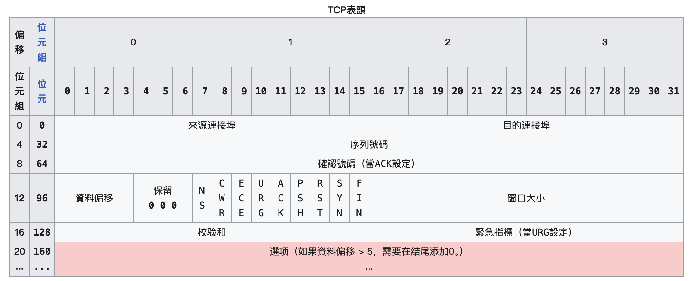

# TCP 与 UDP

TCP 提供有序、可靠的字节流，UDP 提供保留消息边界的无连接数据报；应用应根据传输语义选择协议。

:::tip 核心要点
TCP 在传输层处理确认、重传、有序交付、流量控制和拥塞控制。

UDP 不提供这些保证，但应用可以按自己的需求实现可靠性、顺序和拥塞控制。QUIC 就是在 UDP 之上建立可靠传输的协议。
:::

## 1. TCP 与 UDP 简述

### 1.1. TCP 与 UDP 的核心区别

[网络模型](./network-models.mdx)一章提到过，**传输层**关注的是如何传输应用层的数据。

为了应对不同的传输场景，传输层提供了两种不同的传输协议：

1. **TCP**：Transmission Control Protocol，传输控制协议。
2. **UDP**：User Datagram Protocol，用户数据报协议。

TCP 面向连接，并向应用提供可靠、有序的字节流。UDP 直接发送数据报，保留消息边界，但不保证送达、顺序或去重。

### 1.2. TCP 与 UDP 的使用场景

TCP 适合需要可靠、有序字节流，并希望直接使用操作系统传输控制能力的场景。常见的有：

1. 浏览网页、视频、图片等等
2. 下载文件
3. 收发邮件

UDP 适合需要保留数据报边界、允许应用自行控制重传与时延，或者支持组播的场景。常见的有：

1. 视频会议
2. 在线游戏

DNS 的常规查询也经常使用 UDP；HTTP/3 则通过基于 UDP 的 QUIC 提供可靠传输。协议选择不能只按“是否允许丢包”判断。

## 2. TCP

### 2.1. 可靠传输需要面对的问题

在谈及 TCP 为什么是 「**可靠**」 的传输协议之前，我们先来了解一下网络传输过程中，可能会面对的问题。

网络传输面对的最根本的问题：

> **网络本身是不可靠的**

相信我们日常生活中都遇到过这些问题：

1. 下载文件下载到了一半就丢失了
2. 语音电话、视频会议的时候，对方的声音忽然断断续续的
3. 网页上的图片加载了一半，突然就卡住了，无法加载剩下的一半

这都是网络不稳定导致的传输问题（当然，第 2 个例子通常会使用 UDP 协议）。

而 TCP，就是为了保证尽可能地将数据，从发送方完整地传输到接收方。它的「可靠」，就是解决了网络传输中，网络不稳定可能导致的种种问题。

### 2.2. TCP 可靠性设计

#### 2.2.1. 面向连接

TCP 是「**面向连接**」的协议。

如何理解 TCP 的面向连接？它要求在传输数据之前，数据的「**发送方**」与「**接收方**」保证一件事情：

> 发送方可以收到接收方的「消息」，接收方也可以收到发送方的「消息」。

当双方都保证可以收到对方的消息后，才会开始传输数据。建立连接的过程，被称为「**三次握手**」。

同样，在数据传输之后，也要确保所有的数据都传输完成，这个过程被称为「**四次挥手**」。

TCP 握手与挥手的过程，我们会在 [TCP 三次握手与四次挥手](./tcp_handshake.mdx) 中详细讨论。

#### 2.2.2. 数据分段

如果一次传输大量的数据，比如一个 `1000MB` 的视频，那么一旦因网络波动导致传输失败，就需要重新传输一整个文件。这显然是不可接受的。

因此 TCP 在传输数据时，会尽可能地将数据分割成更小的数据包，然后分批次传输。

这样做的好处是，即使网络波动导致数据包丢失，也只需要传输丢失的数据包即可，避免重新传输一整个文件。

同样每一个分段也会有一个序号，这样接收方在接收到数据后，可以按照序号重新组装成原始数据。如果丢失了某个数据包，也可以告诉发送方缺失的序号，发送方会重新传输。

#### 2.2.3. 校验与重传

解决了数据分段的问题后，接下来还要保证我们接受的数据包的正确性。网络传输的不确定性，让我们可能会接收到不完整的数据包，或者错误的数据包。

一个简单的解决办法是，计算传输内容的「**校验和**」，接收方接收到数据包后，重新计算一下校验和，如果与发送方计算的校验和一致，则认为数据包是完整的。

#### 2.2.4. 拥塞控制

TCP 的可靠性设计，还包含了对网络拥塞的控制。

网络拥塞，会导致数据包的丢失。TCP 会通过「**拥塞控制**」来避免网络拥塞。

拥塞控制的核心思想是，当网络拥塞时，降低发送方的发送速率。

### 2.3. TCP 头部

一个典型的 TCP 数据包通常分为两个部分：

1. TCP 头部 - TCP Header
2. TCP 负载 - TCP Payload

负载就是需要传输的内容，这里我们重点讨论 TCP 头部。

完整的 TCP 头部内容比较多，完全记住难度很大，也没有必要。只需要记住，**保证 TCP 可靠性的字段，都存储在 TCP 头部**。

TCP 头部中，最重要的字段是：

1. 源端口 - Source Port：发送方的端口
2. 目的端口 - Destination Port：接收方的端口，与源端口共同标识一个连接，TCP 与 UDP 共用的头部
3. 序列号 - Sequence Number：当前接收到的数据包的序号
4. 确认号 - Acknowledgment Number：期望的下一个数据包的序号
5. 窗口大小 - Window Size：通知对方自己还能接收多少数据，用于流量控制
6. 校验和 - Checksum：用于校验数据包的完整性
7. 标志位 - Flags：用于控制 TCP 的连接状态，比如「三次握手」与「四次挥手」中使用的 `SYN`、`ACK` 和 `FIN`

这些也对应了我们提到的 TCP 可靠性的设计。

另附一个完整的 TCP 头部示例：

## 3. UDP

### 3.1. TCP 的额外开销

与 TCP 相对，UDP 是「**不可靠**」的传输协议。

UDP 省去了连接建立和传输层确认等机制，但这不自动保证更低的端到端延迟。应用如果需要可靠、有序交付，仍要承担相应控制成本。

TCP 通常需要一次往返完成三次握手后再传输应用数据。连接复用、TCP Fast Open 和上层协议设计会改变实际请求所需的往返次数。

类似的操作还有很多，这些操作都会导致 TCP 在发送数据包之前，有额外的操作。

### 3.2. UDP 的特点

UDP 发送接口只把数据报交给本机协议栈，不提供送达、顺序或去重保证。数据报可能丢失、重复或乱序，应用需要决定这些情况是否需要处理。

比如说，在一个视频会议中，我们可以接受偶尔的断联，但是更多时候，还是希望对方的声音是流畅的。

### 3.3. UDP 的头部

UDP 的头部比较简单，

1. 源端口 - Source Port
2. 目的端口 - Destination Port
3. 长度 - Length：UDP 数据包的长度
4. 校验和 - Checksum：用于校验数据包的完整性

UDP 的长度字段覆盖头部与数据。UDP 保留数据报边界：一次发送对应接收端的一条数据报，但过大的数据报可能触发 IP 分片或直接发送失败，因此应用仍应控制大小。TCP 对应用呈现字节流，不保留每次 `send` 的边界。

## 4. 选择 TCP 或 UDP

TCP 与 UDP 是传输层中最重要的两个传输协议。

选择时检查应用需要的是可靠有序的字节流，还是保留边界、可自行处理丢包与顺序的数据报。

围绕着 TCP 「可靠」的设计，TCP 有如下的特性：

1. 面向连接
2. 数据分段
3. 校验与重传
4. 拥塞控制

UDP 头部和传输层机制更少，但最终性能取决于应用协议、网络状况和实现。需要可靠传输时，应用不能省略确认、拥塞控制与重传等成本。

## 5. 常见问题

### 5.1 UDP 一定比 TCP 快吗

不一定。UDP 建连成本低、协议头较小，但如果应用需要可靠性，就要自行实现重传、顺序和拥塞控制。长连接复用后，TCP 的握手成本也不会出现在每次请求中。

### 5.2 TCP 的一次 `send` 对应接收方的一次 `read` 吗

不对应。TCP 是字节流，发送端的多次写入可能在接收端合并，也可能一次写入被多次读取。应用层必须自己定义消息长度或分隔方式。

## 6. 面试题

### 6.1 TCP 和 UDP 有哪些差异，实际项目中怎样选择

<!-- 面试来源：
- 美团：https://www.nowcoder.com/discuss/624946712360001536
-->

**出现公司**：美团

**考察重点**

- 连接、可靠性、有序性和消息边界。
- 流量控制、拥塞控制与应用层责任。
- DNS、实时音视频和 QUIC 等实际场景。

**相关内容**：[TCP 与 UDP 简述](#1-tcp-与-udp-简述)至[常见问题](#5-常见问题)。

参考回答

TCP 是面向连接的可靠有序字节流，通过序列号、确认、重传、接收窗口和拥塞控制处理网络不可靠；它不保留应用写入边界。UDP 是无连接数据报，保留每条消息的边界，但不保证送达、顺序或去重，头部和传输层状态更少。

文件传输、数据库连接等通常直接使用 TCP。实时音视频或游戏可能选择 UDP，以便应用按时效决定是否重传；DNS 常规查询也多用 UDP。HTTP/3 使用 UDP 之上的 QUIC，说明 UDP 不等于应用不可靠。最终要按连接建立成本、消息边界、丢包处理、拥塞控制和部署环境选择。

:::note 参考资料

1. [RFC 9293：Transmission Control Protocol](https://www.rfc-editor.org/rfc/rfc9293)
2. [RFC 768：User Datagram Protocol](https://www.rfc-editor.org/rfc/rfc768)
3. [RFC 9000：QUIC](https://www.rfc-editor.org/rfc/rfc9000)

:::
