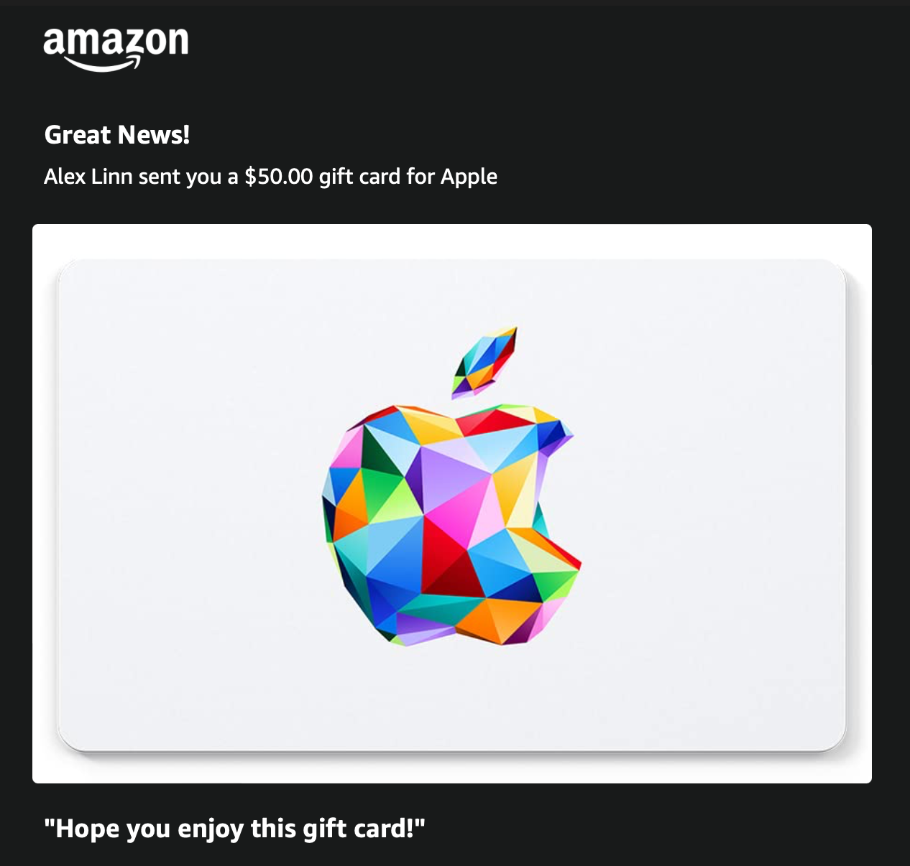
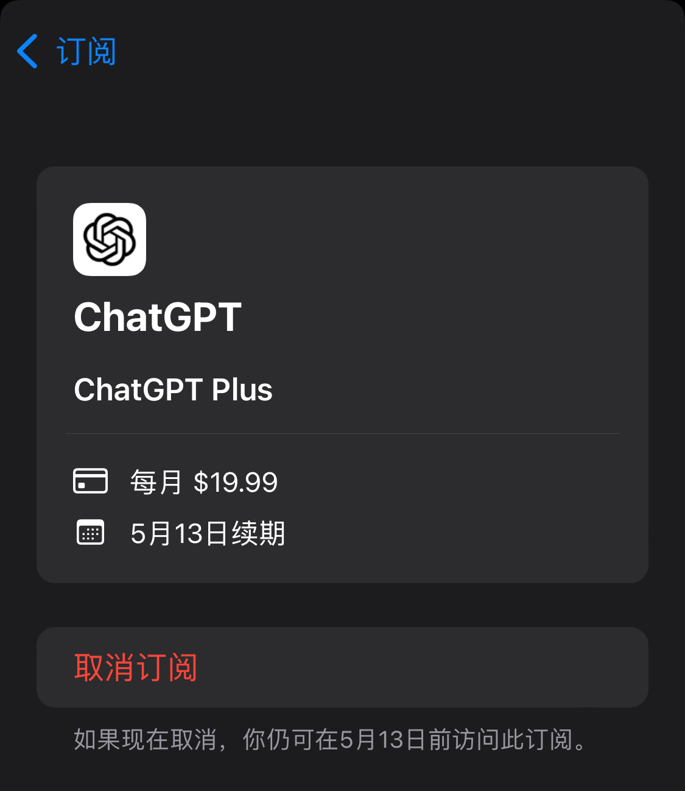
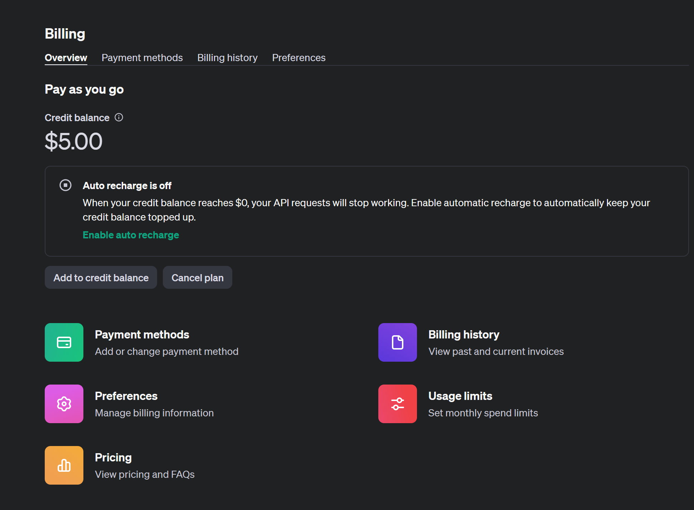

# ChatGPT 的注册与充值

## 1. 注册

截止到 2024 年 5 月，非注册用户也可以使用 ChatGPT 进行对话，但是无法保存对话历史，并且不能使用最新的 4o 模型，因此还是建议注册一个账号。

现在的登录有流程也很简单，可以直接使用第三方账号登录。考虑到注册的便捷性，建议先注册微软账号，再使用微软账号登录 ChatGPT。

1. [微软账号注册](https://account.microsoft.com/account)
2. [ChatGPT](https://www.chatgpt.com/)

## 2. 充值

ChatGPT 免费提供了 3.5 模型，已经具备了很强的对话能力，但是如果想要使用更强大的 4o 模型，还是需要充值使用。

ChatGPT 的月费为 $20，以订阅服务来讲价格偏高，但是有相关使用需求的话，绝对物有所值。

但是在中国大陆充值 ChatGPT 并不是一件容易的事情，ChatGPT 会验证银行卡的地址，而中国大陆的银行卡地址是无法通过验证的。这里介绍我使用的两种充值方式。

### 2.1. 美区 Apple Store + 礼品卡

ChatGPT 的 App 登录了美区的 App Store，因此可以通过 App Store 来订阅。美区 App Store 可以通过购买礼品卡来充值，这样就可以绕过银行卡地址验证。

1. **美区 Apple ID 注册**

在 [iCloud 官网](https://www.icloud.com/)上可以直接注册，需要注意不要访问到国区 iCloud（国区 iCloud 有云上贵州标识，域名以 `.cn` 结尾）。

如果需要填写地址，可以使用美国地址生成器，建议生成免税州如 Oregon 的地址。

2. **Apple 礼品卡购买**

美区的礼品卡有很多购买渠道，我使用的是 [Amazon](https://www.amazon.com/)，搜索 **Apple Gift Card** 即可。亲测可以使用大陆发行的 Visa 卡购买，我使用的是招商银行的卡。

3. **充值**

收到礼品卡的邮件后，在 Apple Store 中兑换礼品卡，然后在 ChatGPT App 中订阅即可。

{/*  */}

### 2.2. 海外银行卡

使用 App Store 充值可以说是一个绕远的行为，最直接的方式是直接用国外的银行卡。

几乎所有的国外的银行卡办理都有一定的门槛，但是依然有一家银行，只要有护照即可办理，那就是**新加坡华侨银行 OCBC**。

在应用商店中搜索并安装 OCBC 的客户端，按照流程申请账户即可。审核通过后，默认会开一个新加坡元账户和一个美元账户。还可以在客户端中额外申请一个 360 账户，会寄一张实体的卡片，国内地址可收。

实测使用 360 账户的实体卡片可以购买 ChatGPT 的 API 额度。

