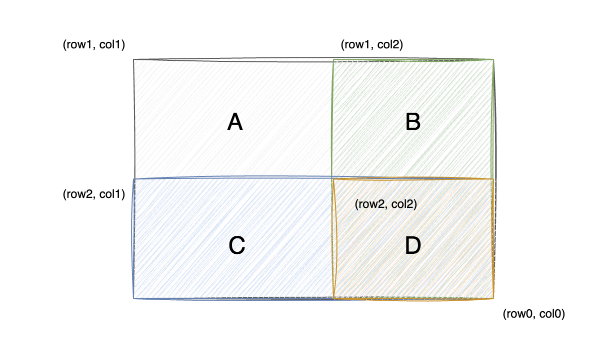

import { Blue, Green, Yellow, Red } from '@site/src/components/priority-tag';

# 304. 二维区域和检索 - 矩阵不可变

## 1. 题目简介

难度：<Yellow>中等</Yellow>，原题链接：[304. 二维区域和检索 - 矩阵不可变](https://leetcode.cn/problems/range-sum-query-2d-immutable/)。

> 给定一个二维矩阵 `matrix`，以下类型的多个请求：
>
> - 计算其子矩形范围内元素的总和，该子矩阵的左上角为 `(row1, col1)` ，右下角为 `(row2, col2)` 。
>
> 实现 `NumMatrix` 类：
>
> - `NumMatrix(int[][] matrix)` 初始化 `NumMatrix` 对象。
> - `int sumRegion(int row1, int col1, int row2, int col2)` 返回左上角 `(row1, col1)` 、右下角 `(row2, col2)` 的子矩阵的元素总和。

## 2. 问题分析

这个题目是一个韦恩图的变种。

我们无法保存矩阵中任意两点围城的子矩阵的算术和，这个计算量会很大。但是我们可以轻松的计算出矩阵中任意一个点与最右下角围成的子矩阵的算术和。

我们将原题的矩阵抽象为计算下面图的面积。



原题求的是从 `(row1, col1)` 到 `(row2, col2)` 的子矩阵的元素总和。图中我们表示的是从 `(row1, col1)` 一直到矩阵的最右下角 `(row0, col0)` 的部分。

我们观察图中的四个矩形部分：

1. A：从 `(row1, col1)` 到 `(row0, col0)` 的矩形
2. B：从 `(row1, col2)` 到 `(row0, col1)` 的矩形
3. C：从 `(row2, col1)` 到 `(row0, col0)` 的矩形
4. D：从 `(row2, col2)` 到 `(row0, col0)` 的矩形

那么从 `(row1, col1)` 到 `(row2, col2)` 的子矩形的面积就是：

```
area = A - B - C + D
```

换算回矩阵，就是最终需要求得的子矩阵的算术和。

我们只要再初始化时，计算出每一个点与最右下角围成的子矩阵的算术和，那么后续的计算就只需要通过查表的方式来获取。

## 3. 代码实现

```java
class NumMatrix {

    private int[][] sums;

    public NumMatrix(int[][] matrix) {
        int m = matrix.length;
        int n = matrix[0].length;
        // 这里需要多申请一行一列，可以避免边界条件的判断
        sums = new int[m + 1][n + 1];
        sums[m - 1][n - 1] = matrix[m - 1][n - 1];
        for (int i = m - 1; i >= 0; i--) {
            for (int j = n - 1; j >= 0; j--) {
                sums[i][j] = matrix[i][j] + sums[i + 1][j] + sums[i][j + 1] - sums[i + 1][j + 1];
            }
        }
    }

    public int sumRegion(int row1, int col1, int row2, int col2) {
        return sums[row1][col1] - sums[row1][col2 + 1] - sums[row2 + 1][col1] + sums[row2 + 1][col2 + 1];
    }
}
```

## 4. 复杂度分析

- 时间复杂度：
  1. 初始化的时间复杂度：**O(n)**，计算的时候从最右下角开始计算 `sums[i][j]`，每次计算只需要常数时间。
  2. 查询的时间复杂度：**O(1)**，每次查询只需要常数的计算时间。
- 空间复杂度：**O(n)**，需要一个额外的矩阵来保存每个点与最右下角围成的子矩阵的算术和。