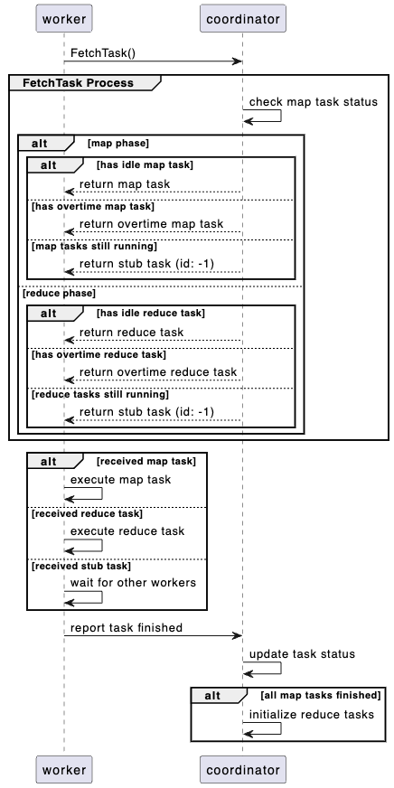

# 实验 1: MapReduce

## 1. 实验简介

实验地址：[https://pdos.csail.mit.edu/6.824/labs/lab-mr.html](https://pdos.csail.mit.edu/6.824/labs/lab-mr.html)

实验 1 要求使用 GoLang 实现 MapReduce 模型。虽然要求看上去比较吓人，但是实验本身提供了一些基本的代码，只需要实现核心的 `Coordinator` 和 `Worker` 即可。另外实验实现的是一个简化版本的 MapReduce 模型，只需要处理 `Map` 和 `Reduce` 两个阶段。

即使对 GoLang 不是十分熟悉，预计在 1 天内也可以完成实验。

## 2. 基本配置

实验使用 Git 托管，用 GoLang 开发，因此需要提前配置好 Git 与 GoLang：

- Git: [Git Download](https://git-scm.com/downloads)
- GoLang: [GoLang Download](https://golang.org/dl/)

实验代码可以在 MIT 6.824 的 [官网](https://pdos.csail.mit.edu/6.824/labs/lab-mr.html) 上找到。这里不再赘述。

## 3. 实验要求

在实验页面的「Your Job」一节中，给出了实验具体要求。简单总结一下：

> 1. 实现 `Coordinator` 类，实验中只有一个 `Coordinator` 实例。
> 2. 实现 `Worker` 类，实验中有至少一个 `Worker` 实例。
> 3. `Worker` 与 `Coordinator` 通过 RPC 通信。
> 4. `Worker` 从 `Coordinator` 获取任务，并执行以下流程：
>    - 从 `Coordinator` 获取任务
>    - 读取任务的输入
>    - 执行任务
>    - 将任务结果写入到指定位置
>    - 通知 `Coordinator` 任务完成
> 5. `Coordinator` 负责管理任务的状态，包括重新分配超时任务（本实验中超时时间设置为 10 秒）。

实验提供了一些基本的代码，这些代码用于创建并启动 `Coordinator` 与 `Worker`，**不要修改这些代码**：

- `main/mrcoordinator.go`
- `main/mrworker.go`

需要实现的代码如下：

- `mr/coordinator.go`
- `mr/worker.go`
- `mr/rpc.go`

## 4. 任务细分

根据对 MapReduce 的理解，以及实验提供的代码，我们可以进一步细化实验的需求。

### 4.1. Coordinator

本实验中只有一个 `Coordinator` 实例。考虑到 MapReduce 论文中对于 Coordinator 的描述，我们需要实现以下功能：

- 管理任务状态：任务可以分为「初始化」、「进行中」、「完成」三种状态。
- 分配任务：
    - 找到「初始化」状态的任务，分配给 Worker 执行，并将其状态设置为「进行中」。
    - 如果有任务的执行时间超过 10 秒，则重新分配给其他 Worker 执行。
- 管理文件地址：
    - 每个 `Map` 任务的输入文件
    - `Map` 任务的输出文件（Intermediate Files）
    - `Reduce` 任务的输出文件

另外还有一些需要注意的点：

- Coordinator 同时负责分发 `Map` 任务和 `Reduce` 任务，但是 `Reduce` 任务依赖于 `Map` 任务的输出，需要在 `Map` 任务执行完毕后才能开始分发。
- 实验中存在至少一个 `Worker` 实例，多个 `Worker` 存在竞争关系，在更新任务状态时需要加锁。

### 4.2. Worker

区别于论文中的描述，本实验中的 `Worker` 为一个函数，通过 RPC 从 `Coordinator` 获取并执行任务。根据实验的描述，`Worker` 需要实现以下功能：

- 从 `Coordinator` 获取任务
- 执行 `Map` 或者 `Reduce` 任务
- 将任务的输出写入到指定位置
    - `Map` 任务的输出：`mr-X-Y`，其中 `X` 为 `Map` 任务的编号，`Y` 为 `Reduce` 任务的编号。`Y` 可以通过 `ihash` 函数计算得到
    - `Reduce` 任务的输出：`mr-out-Y`，其中 `Y` 为 `Reduce` 任务的编号
- 通知 `Coordinator` 任务完成，以及上报输出文件地址

通常每一个任务都有不同的输出文件，但是在异常发生时，可能会有多个任务向同一个文件输出。实验中建议使用 `ioutil.TempFile` 创建临时文件，等到任务执行完毕后，再重命名为最终的文件名。

### 4.3. RPC

本实验使用 RPC 进行 `Worker` 与 `Coordinator` 之间的通信。基本的 RPC 框架已经提供，因此只需要考虑实验中需要的 RPC 方法即可。

- `Worker` 从 `Coordinator` 获取任务
- `Worker` 通知 `Coordinator` 任务完成，以及上报输出文件地址

## 5. 实验实现

由于官方并不建议将实验的实现开源，避免学生直接抄袭，因此这里不会贴出完整的代码。（虽然我也并不相信 MIT 的学生会抄我...）

本文将仅贴出部分关键代码，也鼓励读者自行实现并优化，这真的很有趣。

### 5.1. Coordinator 与 Task 的结构

在实现细化部分没有提到的是，为了简化对于「任务」实例的管理，我们需要定义一个 `Task` 结构体，表示一个任务。

```go
type Task struct {
    TaskType string    // Map 或 Reduce
    TaskID   int       // 任务编号
    Inputs   []string  // 输入文件
    Outputs  []string  // 输出文件
    Status   string    // 初始化、进行中、完成
    CreateAt time.Time // 任务创建时间
}
```

通过对与任务的细化，我们也能较为容易的写出 `Coordinator` 的结构体。

```go
type Coordinator struct {
    mu           sync.Mutex // 锁，用于保护任务状态的更新
    tasks        []Task     // 任务列表
    nReduce      int        // Reduce 任务的数量
    nMap         int        // Map 任务的数量
    finishedMaps int        // 完成的 Map 任务的数量
}
```

根据不同的实现，`Coordinator` 的初始化方法也会有所不同，比如分开存储 `Map` 任务和 `Reduce`，可以在一定程度上简化任务分配

### 5.2. Worker 与 Coordinator 的交互

Worker 与 Coordinator 的交互流程如下：



1. Worker 通过 `FetchTask` 方法从 Coordinator 获取任务
2. Coordinator 根据任务状态分配任务
    - 分配「初始化」与超时任务
    - 修改任务状态为「进行中」
3. Worker 执行任务
    - 根据当前所处的 Map 还是 Reduce 阶段，执行用户定义的 `Map` 函数或者 `Reduce` 函数
    - 将任务的输出写入到指定位置
4. Worker 通过 `ReportTask` 方法向 Coordinator 上报任务完成
5. Coordinator 更新任务状态

### 5.3. RPC 方法

从交互流程中我们可以观察到，Worker 与 Coordinator 的交互方法主要有两个：

- `FetchTask`：Worker 从 Coordinator 获取任务
- `ReportTask`：Worker 向 Coordinator 上报任务完成

那么重点实现这两个方法即可。根据对 `Coordinator` 与 `Task` 的定义不同，此处的实现也会有所不同，这里不列举出详细的代码了，大家可以自行实现。

## 6. 测试

代码仓库中包含了测试脚本，实验页面也给出了完整的测试方法，参考执行即可。

## 7. 总结

本实验通过实现一个简化版本的 MapReduce 模型，帮助大家加深了对 MapReduce 的理解，尤其是在 MapReduce 实现过程中的容错处理，以及如何处理多个 Worker 竞争的问题。

虽然「实现一个 MapReduce」的标题看上去有些吓人，但是经过对实验需求的分析与细化，可以发现实验本身的难度不高，实现的时间也不会太长，强烈建议大家都亲自实现一遍，一点一点的调试、优化，完成本实验。