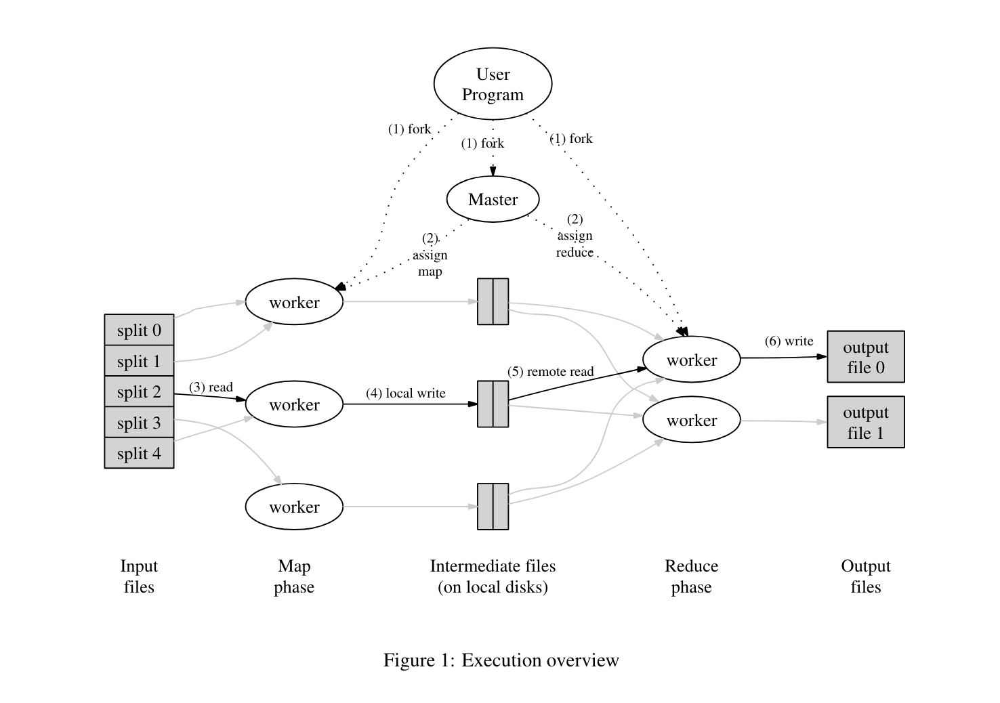

# Lec 1: MapReduce

## 1. 论文介绍

MapReduce 是 Google 于 2004 年提出的分布式计算模型，用于处理大规模数据集的并行处理。

MapReduce 的核心思想是将单机无法处理的大规模的计算任务拆分为多个子任务，并行处理每一个子任务，最后合并子任务的结果。

MapReduce 的论文地址为：[MapReduce: Simplified Data Processing on Large Clusters](https://pdos.csail.mit.edu/6.824/papers/mapreduce.pdf)。

本文为 MapReduce 的学习笔记，仅会记录 MapReduce 模型上的重要概念，更多细节请参考论文原文。

## 2. Google 面对的挑战

作为世界上最大的搜索引擎，早在 2004 年时，Google 需要处理的数据量已经达到了 TB 级别，数据规模已然超过单机处理的极限。

如何能够高效的处理这些数据，是 Google 所面对的挑战。

一种很自然的解决方案，就是将原始数据进行分片，当分片足够小后，就可以在消费级的电脑上处理每一个分片，最后将所有分别的结果合并，即可获得最终的结果。

那么接下来的问题，变成了：

1. 如何对原始数据进行分片，如何处理每一个分片
2. 如何在集群中处理每一个分片任务，如何保证每一个任务可以正确执行
3. 如何保证任务的执行效率
4. 如何降低用户的使用成本，用户无需了解分布式系统的处理细节

## 3. MapReduce 编程模型

用户在使用 MapReduce 时，需要提供 Map 与 Reduce 函数。原始数据在经过 Map 与 Reduce 函数两轮处理后，即可获得最终的结果。

### 3.1. Map 函数

1. 作用：将原始数据分割，转为中间结果，以便 Reduce 函数聚合
2. 输入：(Key, Value) 键值对
3. 输出：(Key, Value[]) 键值对。经过 Map 处理过的原始数据，可能有多个 Value 对应同一个 Key。

### 3.2. Reduce 函数

1. 作用：将中间结果聚合，生成最终结果
2. 输入：(Key, Value[]) 键值对
3. 输出：(Key, Value) 键值对

### 3.3. 示例：WordCount

以统计文本中单词出现的次数为例，用户定义的 Map 函数为：

```python
# key: 文件名
# value: 文件内容
# 输出：(word, 1) 键值对。对于文件中的每一个单词，输出一个键值对
def map(key, value):
    words = value.split()
    for word in words:
        yield (word, 1)
```

用户定义的 Reduce 函数为：

```python
# key: 单词
# values: 单词出现的次数
# 输出：单词出现的总次数
def reduce(key, values):
    return sum(values)
```

## 4. MapReduce 的执行流程



1. MapReduce 初始化
    1. 用户发起 MapReduce 任务的执行请求，MapReduce 库执行初始化操作
    2. 将原始文件分割为 `M` 个小规模的分片，也就是 `Map` 任务的个数。
    3. 初始化 Worker 集群，并且将其中一个节点设置为 **Master**。
2. **Master** 分配 Map 与 Reduce 任务
    1. 共有 `M` 个 Map 任务，`R` 个 Reduce 任务，`R` 由用户指定。
    2. `M` 的数量通常大于 `R` 的数量，因为 Map 函数相对 Reduce 函数来说更加轻量。
    3. **Master** 将任务分配给空闲的 Worker 节点。
3. 执行 Map 任务
    1. Worker 拉取分片数据，执行 Map 函数
    2. Map 的输出会写入到缓存中
4. Map 输出持久化 -> 生成 中间文件（Intermediate Files）
    1. 周期性将缓存中的 Map 函数的输出写入到磁盘中，位置在执行 Map 任务的 Worker 节点上
    2. 输出的内容会根据 Key 值分割为 `R` 个文件，每个文件对应一个 Reduce 任务
        1. 分割算法类似 `Hash(key) % R`，对应了 Reduce 任务的 ID 范围 `[0, R)`
        2. 参考 Lab 1 的实现，中间文件名类似 `mr-X-Y`，其中 `X` 为 Map 任务的 ID，`Y` 为 Reduce 任务的 ID
    3. 输出的位置会返回给 **Master**，以便 Reduce 任务可以读取到 Map 任务的输出
5. 执行 Reduce 任务
    1. **Master** 根据 Reduce 任务的个数，将 Reduce 任务分配给空闲的 Worker 节点
    2. Worker 节点会根据 Reduce 任务的 ID，拉取所有相同 Reduce 的中间文件
    3. 读取了所有中间文件后，会根据 Key 值对所有的中间数据进行排序
    4. Reduce 函数会在 Map 函数执行结束后执行，可以避免数据不全导致某些一致性问题
6. Reduce 输出持久化
    1. Reduce 的输出会写入文件系统中。在 Google 的实现中，使用了 GFS 作为文件系统
7. 执行结束
    1. 等待所有的 Map 任务与 Reduce 任务执行结束后，MapReduce 会通知用户执行结果

可以看出在 CAP 原则中，MapReduce 遵循了 CP 原则，用户在 MapReduce 任务执行期间等待，直到任务执行完成。

## 5. 容错

### 5.1. Master 容错

从 MapReduce 的架构图中可以发现很重要的一点:

> **MapReduce 中 Master 节点是单点的**。

这也意味着 Master 节点的故障将导致 MapReduce 整体故障。

单点任务的容错通常使用备份的方式，Master 节点会周期性地将 Master 的状态（State）持久化到硬盘上，每个备份称为一个检查点（Checkpoint）。

如果 Master 节点发生故障，MapReduce 库会读取最近的 Checkpoint，恢复 Master 节点的状态，继续执行 MapReduce 任务。

另外，也由于 Master 是单点，所以 Master 的故障率会低于 Worker 节点。因此也可以在 Master 节点故障后，直接通知客户端 MapReduce 执行失败，由用户决定是否要重新执行 MapReduce 任务。

### 5.2. Worker 容错

对于 Worker 节点来说，判断存活的常用手段是心跳检测。Master 会维护所有 Worker 节点的存活、运行状态。

根据 MapReduce 的执行流程，执行 Map 任务与 Reduce 任务的节点有不同的容错机制。

对于执行 Map 任务的节点：

1. 如果 Worker 故障，Master 会将该 Worker 所执行的所有 Map 任务都标记为失败
2. Master 会重新分配该节点执行的所有 Map 任务，即使某些 Map 任务已经执行完成

对于执行 Reduce 任务的节点：

1. 如果 Worker 故障，Master 会将该节点当前执行的 Reduce 任务标记为失败
2. Master 会重新分配该节点未完成的 Reduce 任务

两者的区别在于是否会重新执行该节点已经完成的任务，而 Map 需要重新执行这些任务。因为 Map 的执行结果会保存在本地，而 Reduce 的执行结果会保存在全局文件系统中。

### 5.3. 数据持久化

中间数据和最终结果的一致性需要保证。这两者都是保存到文件中，因此需要保证写入文件的一致性，避免多个 Worker 同时写入一个文件。

MapReduce 在写入文件时，会先将内容写入到一个临时文件中，待全部写入后，再重命名为目标文件名，保证文件写入的原子性。

## 6. 一些优化

MapReduce 论文中提供了一些优化的手段，这里简单介绍一些，更多细节请参考论文原文。

### 6.1. 分片算法

根据不同的 Key 值和 Reduce 需求，可以自定义分片算法，将不同的 Key 值分配到不同的 Reduce 任务中。默认为 `hash(key) % R`。

如果有使用 `user_id`, `ip` 等作为 Key 值，可以使用自定的算法。

### 6.2. Combiner

Combiner 是 Map 函数执行后的一个优化手段，用于减少 Map 任务的输出数据量。

比如 WordCount 中，给定以下输入：
```text
apple, pen, apple
```

默认会输出：
```text
(apple, 1)
(pen, 1)
(apple, 1)
```

Combiner 在执行 Reduce 前，会将 Map 的结果提前聚合一次，减少 Map 任务的输出数据量，达到节约带宽的目的。此时，输出结果会变成：

```
(apple, 2)
(pen, 1)
```

Combiner 函数通常与 Reduce 函数一致。只是 Reduce 会聚合所有的 Map 的输出，而 Combiner 作用与 Map Worker 上，只聚合当前 Map 的输出。

# 7. 总结

MapReduce 是一种分布式计算模型，用于处理大规模数据集的并行处理。

MapReduce 的核心思想是将单机无法处理的大规模的计算任务拆分为多个子任务，并行处理每一个子任务，最后合并子任务的结果。

MapReduce 使用了单 Master 节点分配任务的调度，有效减少了分布式系统中的竞争与一致性问题：

1. 单一 Master 节点分配任务，避免了多节点竞争
2. 所有的任务、Worker 状态在一个节点维护，避免了多节点共享状态导致的一致性问题

实际上除了保证数据一致性的挑战外，MapReduce 还面临了其他挑战：

1. 网络带宽
2. MapReduce 的整体执行时间

Google 也提供了多种优化手段，尽可能减少网络带宽的消耗，缩短 MapReduce 的整体执行时间，在论文中都有涉及，这里不再赘述。

作为 2004 年的论文，虽然目前市面上有了更多的分布式计算模型，MapReduce 本身也有了更多的优化，但是回看论文，其中对于分布式问题的思考与解决，依然具有学习意义。

结合 Lab 1 的实现 MapReduce，也能帮助我们更好的理解 MapReduce 的执行流程与实现细节。