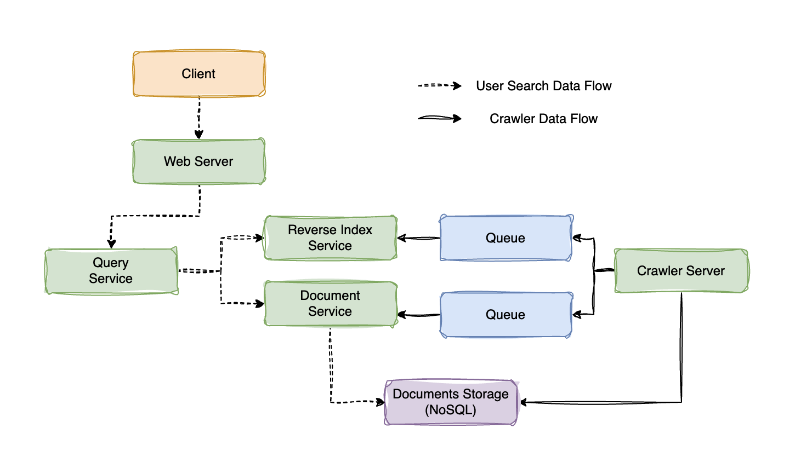
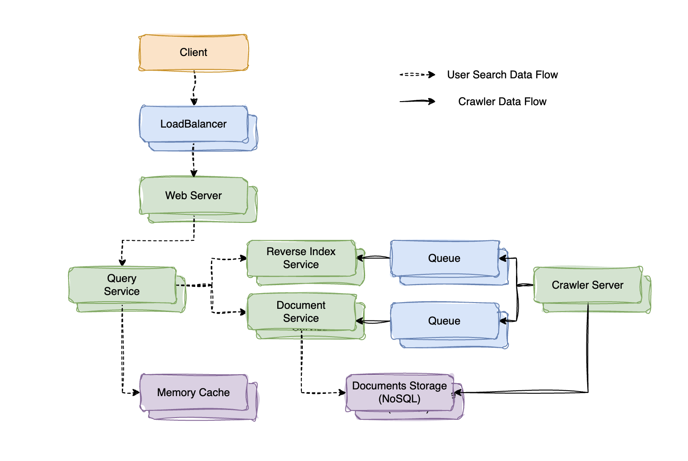

# 设计网页爬虫

:::info 与原始题目的区别
此版本为一个简化版本。

在原始版本中，根据网页内容生成了网页签名，并增加了网页相似度与优先级的判断。
:::

## 1. 明确用例与系统约束

### 1.1. 用例

1. 自动爬取网页
2. 用户查询
3. 系统需要高可用

### 1.2. 系统约束与规模

基本的约束与假设：

1. 爬虫不应该有死循环
2. 用户请求的流量是不均匀的
3. 待爬取的网页平均大小为 `500KB`
4. 假设每周需要爬取 `10亿` 个网页
5. 每月查询为 `1000亿` 次

对应的存储规模为：

1. 每月存储：`10^9 * 500KB * 4 = 2PB`， 3 年总存储为 `2PB * 36 = 72PB`
2. 每周爬取 `10亿` 网页，对应写请求 QPS 为 `10^9 / (7 * 24 * 3600) ≈ 1600`
3. 每月查询为 `1000亿` 次，对应读请求 QPS 为 `10^11 / (30 * 24 * 3600) ≈ 40000`

## 2. 高层设计

考虑数据规模较大，可以使用 **消息队列** 对写入请求进行削峰与限流，避免写入压力过大。

另外为了避免查询重复的网页，需要维护待爬取列表 `links_to_crawl` 和已爬取的网页列表 `crawled_links`，这两个列表也会有频繁的读取和写入请求，考虑使用 NoSQL 进行保存。



## 3. 核心组件设计

### 3.1. 爬取网页

爬取网页的流程：

1. 从队列中获取待爬取 `links_to_crawl` 的网页
2. 爬取网页内容，保存到 NoSQL 中
3. 生成网页的反向索引
4. 生成网页的标题与摘要信息
5. 将已爬取的网页添加到已爬取的列表 `crawled_links` 中

使用 `PageInfo` 保存爬取的网页的基本信息：

```java
class PageInfo {
    private String url;
    private String title;
    private String content;
    private String summary;
    private List<String> childrenLinks;
    private long timestamp;
}
```

核心的爬虫类 `WebCrawler` 的代码如下：

```java
class WebCrawler {
	private LinkHandler linkHandler;
	private QueueHandler queueHandler;
	
	public void mainProcess() {
		while(true) {
			url = linkHandler.fetchUncrawlLink();
			crawl(url);
		}
	}
	
	/**
	 * crawl page content
	 */
	private void crawl(String url) {
		PageInfo page = crawlPage(url);
		queueHandler.updateDocument(page);
		queueHandler.updateReverseIndex(page);
		
		childrenLinks = page.getChildrenLinks();
		linkHandler.addNewLinks(childrenLinks);
		linkHandler.finish(url);
	}
	
	private PageInfo crawlPage(String url) {
		// real crawling action
	}
}
```

处理 `links_to_crawl` 与 `crawled_links` 的方法：

```java
class LinkHandler {
	// Actually these links saved in NoSQL
	// Use a List type to simplify the representation
	private List<String> linksToCrawl;
	private List<String> crawledLinks;
	
	public String fetchUncrawlLink() {
		return linksToCrawl.get(0);
	}
	
	public String finish(String url) {
		linksToCrawl.remove(url);
		crawledLinks.add(url);
	}
	
	public String addLinks(List<String> urls) {
		for (String url: urls) {
			if (crawledLinks.contains(url)) {
				// TODO check if a crawled page has an update
				continue;
			}
			linksToCrawl.add(url);
		}
	}
}
```

### 3.2. 用户查询方法

设计与用户交互的方式，包括接口与响应。

对于查询来说，可以使用简单的 `GET` 请求：

```shell
curl https://search.com/api/v1/search?q=hello+world
```

响应可以返回查询到的页面列表，使用 `JSON` 格式返回：

```json
[
  {
    "title": "foo's title",
    "snippet": "foo's snippet",
    "link": "https://foo.com"
  },
  {
    "title": "bar's title",
    "snippet": "bar's snippet",
    "link": "https://bar.com"
  }
]
```

## 4. 扩展设计

为了保证系统的高可用性，需要分析一下系统现存的单点与性能问题：

1. 高层设计中的每一个组件都需要部署多个节点
2. 在 `Web Server` 前增加 `Load Balancer` 进行负载均衡
3. 针对用户访问不均匀的情况，增加针对热点内容的缓存

