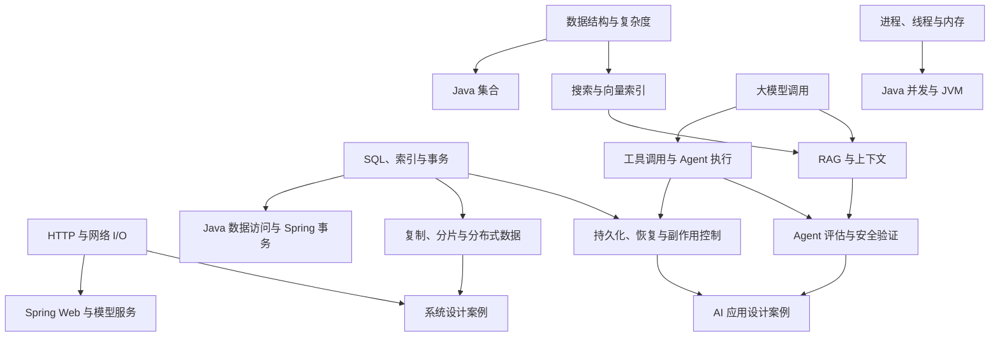

# Coding 101 复习知识树与文档目录

Coding 101 的复习内容按技术概念组织，岗位路线负责说明顺序、重点和停止条件。本轮展开 **Java、通用基础、系统设计、AI 应用与 Agent** 四个领域，并整理它们与现有文档的对应关系。

> **状态：供 Review 的内容规划与本地样例。** 整理日期：2026-09-06。Java 路线和集合导读已有本地实现；其余新增、拆分和归属调整仍为提案，不表示内容已经完成，也不承诺面试题覆盖率。

## 1. Review 入口

| 文档 | 本次要看的内容 |
| --- | --- |
| [Java](./knowledge-tree/java.md) | 知识节点、第一轮考点、Topic 导读入口与 Java 集合示例 |
| [通用基础](./knowledge-tree/foundations.md) | 数据结构与算法、操作系统、网络、数据库、缓存、中间件及工程基础 |
| [系统设计](./knowledge-tree/system-design.md) | 设计方法、分布式原理、常见设计模式与完整设计题 |
| [AI 应用与 Agent](./knowledge-tree/agent.md) | 模型调用、RAG、上下文、工具、运行时、评估、安全与框架实践 |
| [存量文档目录](./knowledge-tree/document-inventory.md) | 全部 264 个文档文件的当前标题、路径、内容形态与建议归属，以及 11 个重定向页面 |

先检查第 5 节的复习入口和 Java 分纲中的集合示例，再确认四个领域的第一轮最小集合。存量目录用于逐篇核对，不要求按文件顺序阅读。

## 2. 现有内容与主要缺口

本次扫描 `docs/` 下的全部 Markdown/MDX 文件，并抽读技术文章、栏目索引、设计题和文风样稿。文件数包含导航页、草稿和占位页，**不能当作已完成文章数**。

| 当前位置 | 文件数 | 现状与本轮判断 |
| --- | ---: | --- |
| `docs/basic-knowledge/java/` | 123 | 多数主题已有正文；通用算法和测试概念需要调整归属 |
| `docs/basic-knowledge/` 下除 Java 外的内容 | 33 | 已有哈希表、数据库索引与事务、部分网络、Redis 和消息内容；SQL、操作系统和基础数据结构存在明显缺口 |
| `docs/system-design/` | 68 | 分布式与可靠性概念较多；完整设计题较少，Pastebin 仅有标题，奶茶店设计仍为草稿 |
| `docs/leetcode/` | 28 | 保留为练习与已有题解；后续重点建设算法主题 |
| `docs/tools-and-frameworks/` | 5 | 目前都是 Git 内容，第一次提交页面只有标题；测试、构建和交付散落在其他目录 |
| `docs/chatgpt-guide/` | 3 | 产品使用指南与简短的 LLM 介绍，尚不能承接 Agent 工程复习 |
| `docs/interview/` 与 `docs/intro.md` | 4 | 已有站点介绍、面试流程和复习指南 |
| **合计** | **264** | 仓库文档盘点，不是逐篇技术验收 |

当前[路线目录数据](../src/data/interviewRoadmaps/outlineCatalog.ts)列出 8 个共享基础入口和 14 个岗位入口，6 个共享基础入口已链接到现有内容，岗位中只有 Java 带有可访问的路线链接。[Java 路线数据](../src/data/interviewRoadmaps/java.ts)组织了 9 个阶段、42 个复习 Topic。知识树的统一元数据只在少量文档中出现，路线仍直接维护文章标题和链接；自动从知识节点生成全部路线属于待建设能力。

优先补齐核心前置知识，把已有文章放回合适的分支，并让路线区分核心阅读、深入阅读和内容缺口。

## 3. 行业参考与采用方式

以下判断来自本轮查阅的公开目录和可访问正文，是本项目的编辑取舍。用户提到的 “guru” 同时参考 **Design Gurus** 与 **Refactoring.Guru**。Design Gurus 的课程详情抓取失败，本轮仅依据官方公开介绍，不推断付费章节内容。

| 参考 | 可观察到的组织方式 | Coding 101 的采用方式 |
| --- | --- | --- |
| [小林 coding：图解系统](https://www.xiaolincoding.com/os/) | 按进程、内存、文件与网络 I/O 等机制展开，图解承担解释工作 | 用状态变化、时序和数据路径解释机制；标题沿用标准概念名 |
| [JavaGuide](https://javaguide.cn/) | Java 主线连接数据库、分布式、系统设计及 AI 应用等共享内容 | 检查后端主题是否遗漏；路线引用共享文章，正文按概念拆分 |
| [Design Gurus](https://www.designgurus.io/) | 区分系统设计基础、完整设计题和算法解题模式 | 基础、模式和综合练习分开；用少量代表练习检验迁移能力 |
| [Refactoring.Guru](https://refactoring.guru/design-patterns/catalog) | 按创建型、结构型和行为型组织设计模式，并提供语言实现入口 | 面向对象设计先选少量能解释变化点的模式；通用模式与 Java 实现分开 |
| [Hello Interview](https://www.hellointerview.com/learn/system-design/in-a-hurry/introduction) 与 [Delivery Framework](https://www.hellointerview.com/learn/system-design/in-a-hurry/delivery) | 从面试所需能力反推核心内容，另设深入材料；设计回答先满足需求，再讨论关键瓶颈 | 第一轮按需要回答的问题选择内容；设计题依次展开需求、接口与数据、主链路、扩展和故障 |
| [Hello 算法](https://www.hello-algo.com/chapter_hello_algo/) | 按复杂度、数据结构和算法主题组织 | 算法按主题建设；题解作为练习入口，解释操作次数、不变量和边界输入 |
| [Hugging Face Agents Course](https://huggingface.co/learn/agents-course/en/unit0/introduction) | 基础概念之后进入框架、用例和评估作业 | 先建立通用执行模型，再选一种框架实现；实践有可检验的任务结果 |
| [Anthropic：Building effective agents](https://www.anthropic.com/engineering/building-effective-agents) | 区分固定工作流与模型自主决策，讨论复杂度、工具和反馈 | 工作流、Agent 执行循环、多 Agent 协作分开；评估、安全和停止条件进入主干 |
| [NN/g：Progressive Disclosure](https://www.nngroup.com/articles/progressive-disclosure/) | 优先展示主要选项，通过明确入口提供次要内容 | 默认展示本轮复习范围，后续学习保留可见入口；是否改善本站使用体验仍需试读验证 |

这些参考支持选题与结构判断，不能证明某个主题在招聘中的出现频率。“必会／常考／按岗选学”是面向指定路线的初始建议，后续用目标 JD 和可核验面经校准。

## 4. 知识树总览

```text
技术复习
├── Java
│   ├── 语言与类型、标准库、集合
│   ├── I/O、并发、JVM
│   └── Spring、数据访问、Java 工程实践
├── 通用基础
│   ├── 数据结构与算法
│   ├── 操作系统与计算机网络
│   ├── 数据库、缓存、消息与搜索
│   └── Git、测试、构建交付、可观测性与应用安全
├── 系统设计
│   ├── 设计方法与接口、数据建模
│   ├── 分布式系统与分布式数据
│   ├── 扩展、可靠性、架构与演进
│   └── 设计题：内容、消息、交易、搜索、任务与 AI 应用
└── AI 应用与 Agent
    ├── 大模型基础与模型调用
    ├── 检索增强生成与上下文管理
    ├── 工具调用、工作流与 Agent 执行
    ├── 状态恢复、记忆与多 Agent 协作
    └── 评估、安全、服务化与框架实践
```

每个叶子概念只有一个正文归属。语言实现、设计模式和综合案例可以引用它。

### 4.1 前置关系



前置关系只要求相关核心节点。例如，Agent 检索需要索引与查询基础，不必先完成全部数据库内容。

### 4.2 归属边界

| 容易重复的内容 | 正文归属 | 引用边界 |
| --- | --- | --- |
| 哈希表／HashMap | 通用数据结构／Java 实现 | HashMap 只展开 Java API 与实现差异 |
| SQL 事务／Spring 事务／Saga | 数据库／Java 框架／分布式数据 | 分别解释数据库保证、框架管理、跨资源业务流程 |
| 缓存一致性／Redis／案例中的缓存 | 通用缓存／Redis 实现／案例 | 案例只解释该业务的 key、失效和故障取舍 |
| 零拷贝 | 通用 I/O | Java API 作为实现示例，Java 路线直接引用 |
| 测试金字塔／JUnit | 通用测试／Java 工具 | 不按语言复制测试分层原则 |
| 向量索引／RAG | 通用搜索与存储／AI 应用 | RAG 解释文档处理、召回、证据和生成链路 |
| 重试与幂等／Agent 恢复 | 系统可靠性／Agent 执行 | Agent 解释模型与工具重放的特有状态边界 |
| API 鉴权／提示注入 | 通用应用安全／AI 应用安全 | Agent 引用鉴权，只新增模型决策中的不可信内容问题 |
| AI 应用完整设计 | 系统设计案例 | Agent 分支链接案例，实践页讲具体实现和验证 |

## 5. 复习入口、优先级与阅读范围

求职者第一次进入网站，需要立即知道从哪里开始、当前要会什么、达到什么程度可以继续。首页和路线首先帮助读者开始一项具体复习；完整目录用于查找和扩展阅读。

### 5.1 优先级与深度

**优先级依附于路线，深度依附于本次复习目标。** 两者都不固定绑定候选人职级。分纲中的建议用于首次 Review，换岗位时可以调整。

| 维度 | 取值 | 使用方式 |
| --- | --- | --- |
| 复习优先级 | 必会／常考／按岗选学 | 必会进入第一轮；常考随后补充；选学需要 JD、项目或面试明确涉及 |
| 回答深度 | 基础回答／原理解释／场景分析 | 分别要求说清定义与差异、执行链路、约束与代价 |
| 阅读层次 | Topic 导读／核心阅读／深入阅读 | 导读标明本轮考点与关键结论；核心阅读覆盖相应机制、示例和边界，深入阅读补充追问 |
| 内容状态 | 已有正文／已有待整理／草稿或占位／拟新增 | 有文件不代表通过技术核验，导航页不等于知识已覆盖 |

第一轮覆盖本岗位的必会考点，深度以能完成对应自测为准。第二轮补充常考内容，也会回到第一轮的同一概念，继续做原理追问和场景分析。按岗选学由 JD、项目和目标面试决定，必要时可以提前进入第一轮。不能把所有原理解释留到第二轮，也不能按整篇文章给所有读者设同一个停止位置。

### 5.2 读者进入与继续复习

Java 路线已按轮次呈现内容，并记录本轮自测进度。集合导读与三篇核心文章已接通阅读、自测和继续入口；下表也包含其他 Topic 后续需要完成的体验。

| 位置 | 默认呈现 | 后续入口 |
| --- | --- | --- |
| 首页与岗位入口 | 已有可用岗位、适用基础与“开始第一轮复习”；再次访问可继续上次内容 | 其他岗位与完整目录；规划中的路线单独说明状态 |
| 岗位路线 | 第一轮的有序任务、本轮考点、下一项；选择依据和停止条件就近说明 | “第二轮：常考与追问”“按岗选学”“全部内容”，可以主动切换 |
| Topic 的 index | 本轮重点、简短的关键结论、指定阅读位置、完成标准；主入口为“开始本轮阅读” | 后续考点及学习触发条件，完整文章目录放在后面 |
| 概念文章 | 当前要回答的问题、面试核心、支撑回答的机制与最小示例；清楚标出本轮阅读范围 | 深入章节或独立文章，在核心范围结束后提供 |
| 阅读结束 | 用一道代表问题检查能否解释，允许标记“待巩固”或“能解释”，继续下一项 | 返回本轮进度、复习薄弱项；读者可以跳过已会内容 |

第一屏突出当前这轮的范围与下一步。全站文章总数、完整知识目录和内部编号不作为开始复习前必须处理的信息。已有基础的读者可以先自测，再决定是否阅读；第一次使用无需先填写长问卷。搜索直达文章时也提供所属 Topic 和复习入口。

进度只计算当前选定范围，并说明“能解释”来自读者自评；打开页面只记为阅读中。内容尚未完成时显示缺口，不计作可完成任务。本轮项数需要在考点筛选后计算，不能把已有文章总数换一个标题当作复习负担。阅读时间先作为编辑估计，经过试读后再给出适用基础和耗时范围。

### 5.3 Topic 的 index

Java 的 J01—J12 每组保留一个 `index` 入口，提供**重点导读、关键结论与阅读顺序**。首屏让读者看清本轮需要回答的 3—5 个问题，并直接进入相应文章或章节。关键结论保留成立条件及简短原因，已有基础的读者可以据此回忆和自测。

不统一要求每个 index 压缩出一篇能独立讲完整个 Topic 的教材。JVM、Spring 等分组需要进一步选择本轮考点；基础薄弱时，由标准概念文章承接解释。index 不必成为每次阅读的中转页，路线的“继续复习”可以直达尚未完成的内容。

每个考点都要对应阅读位置和可检验的完成标准。核心与深入内容可以位于同一篇文章的不同章节；第一轮必须用到的解释和边界直接展开，不能为了页面短而藏进深入阅读。入口中的概括关联标准正文，修改结论时同步检查；岗位路线只保存选择和顺序。

### 5.4 现有页面与优先调整

当前[首页](../src/pages/index.tsx)提供第一轮复习入口，[Java 路线](../src/components/InterviewRoadmap/index.tsx)默认显示 18 项必会任务。完整路线保留 40 个 Topic，分为 18 项必会、15 项常考和 7 项按岗选学。第二轮同时提供常考内容与已学主题的深入阅读，其进度和第一轮分别保存。

每篇路线阅读已明确标记是否属于核心，第一轮任务另有相应考点和自测问题。例如，《BigDecimal》和《包装类型》进入数值相关的核心阅读；集合第一轮覆盖基本选型、ArrayList 和 HashMap，HashMap 的容量与访问顺序追问进入第二轮。当前选择仍需结合目标岗位和实际试读校准。

[Java 集合导读](../docs/basic-knowledge/java/collections/index.mdx)与三篇文章使用同一份[阅读安排](../src/data/reviewPlans/javaCollections.ts)，已提供阅读范围、核心阅读结束位置、原文面试题入口和浏览器本地进度。其他 Topic 目前通过路线专题窗口复习，尚未全部接入文章内的继续导航。

本地检查使用 `npm run preview:local`：构建后在 `http://127.0.0.1:3000` 启动预览，不启用分析统计。页面交互实现与目录提案分开验收，尚未发布这些变更。

知识节点后续至少保存：稳定 ID、标准标题、唯一正文位置、前置节点、相关节点和内容状态。路线保存：节点引用、顺序、优先级、深度、考点、停止条件与明确选择的文章或章节。核心阅读不能只通过文章位置和篇数推断。现有 `data-structures.hash-table` 和 `java.collections.hash-map` 等 ID 继续沿用。

分纲中的 `J01`、`F01`、`S01`、`A01` 只是本次 Review 分组编号；其中 `F01` 等不是线上目录的同名 ID，也不是新的知识节点编码体系。

## 6. 文档目录提案

以下为目标目录；已有文件的当前位置与调整建议见[存量文档目录](./knowledge-tree/document-inventory.md)。拟新增文件名在分纲中列出，尚未建立页面。

```text
docs/
├── intro.md
├── interview/                    # 面试流程、复习方法、项目表达
├── basic-knowledge/
│   ├── java/                     # 语言、集合、JVM、并发、Spring 等
│   ├── data-structures/
│   ├── algorithms/               # 从 Java 下归入通用分支
│   ├── operating-system/         # 新建；包含通用 I/O 与 Linux 基础
│   ├── network/
│   ├── database/                 # SQL、索引、事务、引擎与具体数据库
│   ├── nosql/redis/
│   └── middleware/               # 消息、搜索及向量索引
├── system-design/
│   ├── method/                   # 整理重复的 system-design 层级
│   ├── distributed-system/
│   ├── distributed-data/
│   ├── patterns/                 # 扩展模式与任务调度
│   ├── reliability/
│   ├── availability/
│   ├── architecture/decisions/   # 架构决策与演进，面向相关岗位追问
│   ├── microservices/
│   ├── ood/
│   ├── cases/                    # 完整设计题，包括 AI 应用
│   └── mit6.824/                 # 专题选读
├── tools-and-frameworks/
│   ├── git/
│   ├── testing/
│   ├── build/
│   ├── production/               # 交付、观测、诊断
│   └── security/
├── ai/
│   ├── llm/
│   ├── rag/
│   ├── agents/
│   ├── evaluation/
│   ├── security/
│   ├── serving/
│   └── frameworks/               # LangGraph、Spring AI 等实现
├── leetcode/                     # 已有题解与练习入口
└── chatgpt-guide/                # 产品资料，独立于岗位主路径
```

读者导航建议为“复习路线、Java、通用基础、系统设计、AI 与 Agent、算法练习”。Java 的物理路径继续保留 `basic-knowledge/java/`，导航独立展示。岗位入口由 `src/pages/` 和路线数据承接，不在 `docs/` 再写一份 Java 路线。

Java 的 Topic 导读优先改造现有 `index.mdx`；J01—J03 和 J07—J08 分别增设独立入口，上层语言和并发索引继续承担目录导航。12 个入口的标题、位置和状态见 [Java 分纲](./knowledge-tree/java.md)。

落地时同步修改索引、路线引用和标题，并为变动 URL 保留跳转。现有 `src/pages/docs/` 的 11 个页面都是重定向，不作为额外文章计数。当前阶段只审目录，不迁移页面。

## 7. Coding 101 的文风

**技术主题直接给出核心结论，正文解释原因，再交代会改变回答的条件。** 以已确认的 [Java 泛型](../docs/basic-knowledge/java/language/generics.mdx)为主要样稿，结合 `write-like-linsama` 的直接、克制和因果表达。[文风校准草案](./style-calibration/2026-08-28/STYLE-GUIDE-DRAFT.md)中的待定项继续保持待定。

| 内容类型 | 结构与篇幅边界 |
| --- | --- |
| 栏目目录与岗位路线 | 目标、前置、顺序、重点、停止条件、下一步；默认呈现当前一轮，直接链接导读或指定阅读内容 |
| Topic 导读 | 本轮考点、带条件的关键结论、对应阅读与完成标准；后续学习说明触发条件，篇幅以能迅速做出阅读决定为准 |
| 技术主题 | 标准概念名作标题；开头说明范围，按需给 3—5 条“面试核心”；机制、最小示例、结果、边界，默认 5—10 分钟可复习 |
| 算法主题 | 适用问题与约束、不变量、最小实现、复杂度、边界、代表练习 |
| 系统设计 | 需求与约束、接口和数据、最小读写路径、瓶颈、代价、故障与验证；完整练习可超过技术短文篇幅 |
| Agent 主题 | 明确输入、模型决策、工具、状态和停止条件；验证任务结果、失败行为、耗时与成本 |
| 实践教程 | 前提、步骤、验证；版本差异和失败处理紧跟相关动作 |

图表达结构、时序和状态变化，表格比较选择条件。独立概念或打断主线的深入内容拆成单篇。标题和段首直接说明技术对象，删除刻意对立、抽象比喻、机械排比和重复结论。

技术主题默认保留 1—3 道代表性面试题，采用“出现公司／考察重点／相关内容／默认收起的参考回答”。公司只采用可核验公开面经，链接放在源码注释。尚无来源的题目先作为编辑候选，不补写公司归属。

[事务隔离级别样稿](./style-calibration/2026-08-28/02-technical-transaction-isolation.md)和 [Pastebin 样稿](./style-calibration/2026-08-28/05-system-design-pastebin.md)仍待 Review，不能据此宣称所有文体已定稿。下一轮各选一篇通用基础、系统设计与 Agent 样稿验证，再决定批量建设范围。

## 8. 岗位入口与建设顺序

| 岗位或入口 | 本轮安排 | 内容组合 |
| --- | --- | --- |
| Java 后端开发 | 首批细化；已有路线 | Java + 通用基础核心 + 系统设计基础，AI 按 JD 选择 |
| AI 应用与 RAG 工程 | 首批规划；路线待建设 | 任一服务端语言 + 模型调用 + RAG + 评估 + 通用服务能力 |
| AI Agent 工程 | 首批规划；路线待建设 | AI 应用基础 + 工具与执行 + 恢复、安全、评估 + 一个可验证项目 |
| 共享基础与系统设计 | 首批补齐正文与索引 | 为上述路线提供按需阅读入口 |
| Go、Python、C++ 后端或系统开发 | 后续展开语言分支 | 复用共享基础；Agent 示例不等于已建好 Python 路线 |
| Web 前端、移动通用、Android、iOS | 保留入口，后续规划 | 补齐语言、平台与端侧设计后再组合路线 |
| 大数据与数据工程、测试开发、SRE 与平台工程 | 保留入口，后续规划 | 本轮仅提供部分前置，不宣称覆盖这些岗位 |
| 大模型算法、训练与推理 | 后续独立规划 | 数学、机器学习、训练和推理优化不作为 Agent 的默认前置 |

建议建设顺序：

1. **核定第一轮范围**：按目标岗位逐项对应考点、阅读内容和完成标准，标清占位页及前置缺口。
2. **验证复习入口**：先用 Java 集合试做路线入口、index 导读、核心阅读与自测，检查读者能否直接开始并判断何时继续，再扩展 J01—J12。
3. **补齐复习主线**：补充线性结构、树与堆、SQL、进程与线程、虚拟内存、DNS/TLS、Redis 过期与淘汰；整理共享内容归属。Agent 先完成模型调用、工具执行、评估和安全。
4. **用案例检验知识树**：内容分享、订单支付、知识库问答、客服 Agent。缺少原理时回到唯一归属补节点。

## 9. 本轮 Review 决策

| 决策 | 当前建议 |
| --- | --- |
| 首批范围 | Java、共享基础、系统设计、AI 应用与 Agent；其他岗位保留入口 |
| 首轮复习规模 | 默认展示经过筛选的本轮范围，考点、指定阅读与完成标准逐项对应 |
| Topic 导读入口 | Java 的 J01—J12 每组一个 index，重点与关键结论先行；不要求全部改写成独立的精简教材 |
| 首个体验样例 | Java 集合；先验证开始复习、找到考点、定位解释与完成自测，再铺开其他入口 |
| 内容归属 | 按第 4.2 节与存量目录整理，通用知识跨路线引用 |
| 数据库范围 | MySQL 作为 Java 后端默认实现，通用原理独立；PostgreSQL 按岗位扩展 |
| Agent 实现 | 原理保持框架无关；Python/LangGraph 与 Java/Spring AI 为可选实现，默认只练一条 |
| 设计题首批 | 内容分享、订单支付、知识库问答、客服 Agent |
| 文风 | Java 泛型作为技术基线，其他文体先验收样稿 |

Review 可以直接指出分组编号、文章标题，以及“保留／删除／补充／调整优先级／调整归属”。
