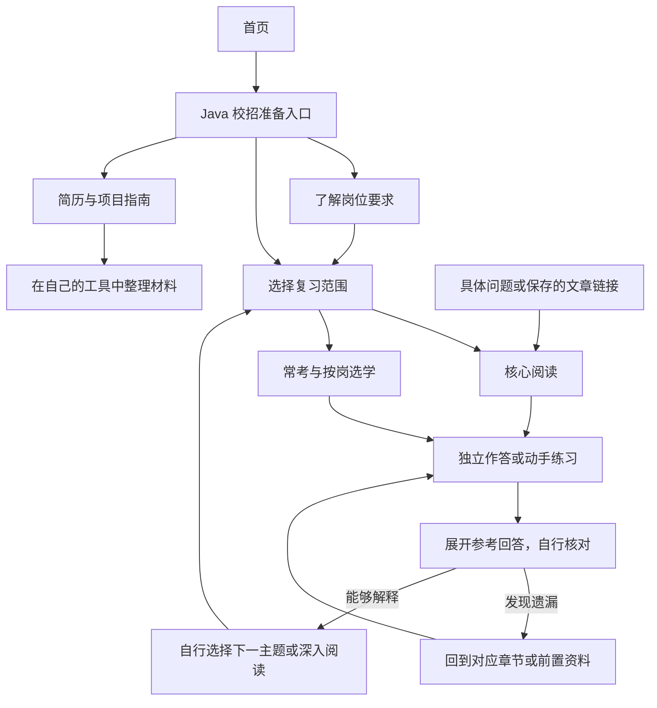

# Java 校招资源站用户故事地图

本地图描述第一期目标体验，用于定义资源与导航需求，当前实现对照见[目标对照](./java-campus-gap-analysis.md)。网站提供可靠资料、阅读顺序和自测依据，用户自行选岗、安排时间、保存笔记、准备简历与投递。

## 1. 故事地图

横向为准备过程的主要活动，纵向展开用户故事与资源。读者可以跳过已熟悉的环节，简历与项目准备和技术复习可以同时进行。

| 层次 | 了解岗位 | 选择范围 | 理解知识 | 练习核对 | 准备材料 | 按需回查 |
| --- | --- | --- | --- | --- | --- | --- |
| 用户目标 | 知道岗位要求什么 | 知道先看什么、看多深 | 讲清概念及机制 | 检查自己是否会回答或实现 | 展示真实能力与贡献 | 查清当前遇到的问题 |
| 核心故事 | 我想比较不同公司的要求，以便选定目标 | 我想看到核心范围，以便自己安排复习 | 我想读到关键结论和示例，以便理解原理 | 我想先作答再核对，以便发现遗漏 | 我想参考写法与示例，以便整理自己的经历 | 我想从具体概念直达正文，以便快速补充知识 |
| 用户行动 | 看资格、技能、加分项与来源，对照目标 JD | 看前置、优先级和完成标准，选择阅读范围 | 读核心章节，理解示例，不懂时补前置 | 口述、写代码或 SQL，展开答案，自行记录问题 | 对照清单写简历，整理项目贡献，练习介绍 | 从主题目录或保存的链接进入，定位章节 |
| 核心资源 | 岗位要求前导、JD 摘要与原始链接 | Java 校招导读、核心主题目录、推荐顺序 | 核心文章、最小示例、常见问题 | 代表题、折叠参考回答、练习链接 | 简历指南、项目清单、自我介绍示例 | 主题导航、稳定链接与章节锚点 |
| 深入资源 | 岗位方向差异与专项要求 | 常考追问、按岗选学及适用条件 | 原理专题、边界与一手资料 | 迁移练习、项目追问与简单设计题 | 技术选择、异常处理与验证证据示例 | 相关主题、前置资料和深入阅读 |
| 用户自行判断的结果 | 能列出目标岗位的准备重点 | 能说明所选主题及选择原因 | 能脱离正文解释核心问题 | 能指出回答的差距 | 描述有事实依据，贡献与取舍能解释 | 找到答案或明确缺少的前置 |

核心与深入都是资源层次，不代表用户等级。深入内容按校招需求建设，不无限扩展。每一步的结果由用户判断，本站不进行诊断、评分或状态记录。

## 2. 使用流程

流程中的分支是普通资源链接和用户选择。确定岗位的读者可以跳过前导，熟悉主题的读者可以直接看题目，直接进入正文的读者不必回到首页。

## 3. 三种典型故事

### 3.1 还有两周，希望抓住核心

“我学过 Java，有一个课程项目，还有两周面试，想知道哪些内容最重要。”

读者从校招入口了解岗位要求，打开核心主题目录，查看前置和阅读边界，将所选内容自行安排到日历或笔记。读完一个主题后独立回答代表题，再核对答案；能解释则继续，发现前置缺口就沿链接补读。同时使用简历与项目清单整理求职材料。

网站需要让核心范围、停止条件和深入入口足够清楚，不提供逐日课表，也不承诺两周能完成所有资料。

### 3.2 有一个月，希望理解原理

“基础问题基本能答，但遇到为什么、换个场景怎么办，就容易卡住。”

读者先看主题代表题，自行选择需要回看的部分；已经掌握核心问题时直接进入机制和常考追问。随后根据目标 JD 或个人项目阅读专项资料，完成迁移练习，并在自己的笔记中记录疑问。

网站需要连接同一概念的基础、原理与场景，不要求所有人先重复全部核心文章，也不把一个月规定成相同的学习量。

### 3.3 刚面试完，只想查一个问题

“我刚被问到 HashMap 的查找过程，没有解释清楚，想查原理和相关追问。”

读者从 Java 集合目录找到《HashMap》，或直接打开保存的文章链接，通过文内目录定位章节。阅读解释后找到对应面试题，自行组织回答再核对；仍有疑问则补前置或深入阅读。最后将需要的链接保存到自己的复盘记录。

网站需要支持按具体问题回查，不强制回到路线起点。题目能指向讲解依据，文章能返回所属主题。

## 4. 页面职责

下列职责可由现有页面承担，不要求每项新增一个页面。入口名称是拟定的内容分类，不表示页面已经实现。

| 页面或资源 | 必须回答的问题 | 后续入口 |
| --- | --- | --- |
| 首页与校招入口 | 适合谁，提供什么？ | 岗位要求、核心复习、面试题、求职指南 |
| 岗位要求 | 依据是什么，哪些共同、哪些按岗？ | 原始 JD、对应复习主题 |
| 复习导读与主题目录 | 先看哪些，前置是什么，读到哪里？ | 核心文章、深入文章、代表题 |
| 技术文章 | 结论、机制、示例和边界是什么？ | 前置资料、文内自测、相关专题、返回目录 |
| 题目索引 | 这一主题有哪些代表问题？ | 所属正文、折叠答案、外部练习资源 |
| 简历与项目指南 | 如何整理真实经历，如何检查表达？ | 示例、核对清单、相关技术知识 |

题目索引维护分类和链接，正文与标准答案维护在所属知识文章中，避免复制一套题库。推荐顺序是静态导航，用户自行决定日程和阅读进度。

## 5. 体验验收

- 首次来访者能找到校招入口和求职指南；直接进入文章者能辨认当前主题与上级目录。
- 选择核心主题后能直达指定阅读范围，知道何时可以停止、在哪里深入。
- 遇到陌生前置概念时有补充入口，阅读不被未解释的关键术语打断。
- 题目默认不暴露参考回答，核对后能找到讲解依据；编码与 SQL 练习有可自行检查的结果或条件。
- 时间有限、希望深入、只查一个问题的读者都能完成相应路径，移动端目录和折叠答案可用。
- 用户自行维护日程、笔记和简历，访问资源不依赖登录、测评、打卡或个人状态。

研究口径与建设范围见[首版交付计划](./java-campus-weekend-plan.md)。本次仅整理故事地图和计划引用，未新增站点功能。
